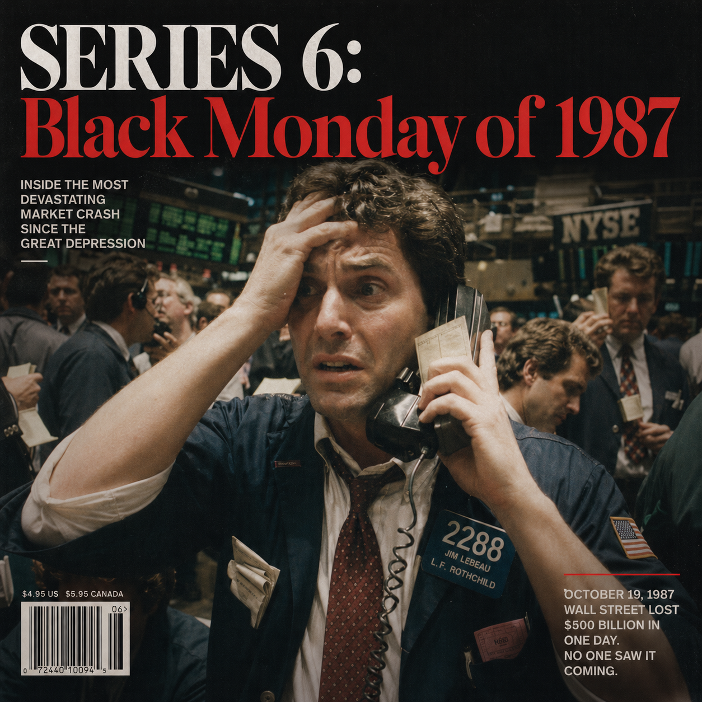

# Part 1 — 다른 세계
# Chapter 1 — 전화로 주문하던 시대

본격적인 이야기를 시작하기 전에, 먼저 그 세계를 이해해야 합니다.

1987년의 주식 시장은 2026년의 그것과 겉모습만 비슷할 뿐, 실제로는 전혀 다른 방식으로 작동했습니다. 어떤 부분은 더 단순했고, 어떤 부분은 더 불투명했으며, 어떤 부분은 지금 기준으로는 놀라울 만큼 원시적이었습니다. 이것을 이해하지 못하면, 왜 그날 시장이 그런 방식으로 무너졌는지를 이해하기 어렵습니다.

---

## 정보는 느렸다

2026년에 주식을 하는 사람들에게 가장 당연한 것 중 하나는 **실시간 시세**입니다. 스마트폰을 꺼내면 어떤 종목이든 지금 이 순간의 가격을 볼 수 있습니다. 심지어 시장 데이터 API를 쓰면 밀리초 단위 호가도 가져올 수 있습니다.

1987년에는 이것이 없었습니다. 더 정확히 말하면, 정보가 없었던 것이 아니라 정보가 층별로 달랐습니다. 플로어에 있는 사람, 대형 기관의 트레이딩 데스크, 쿼트론 단말기를 가진 운용사, 지점 브로커에게 전화하는 개인투자자가 보는 시장은 서로 달랐습니다. 모두가 같은 가격표를 보는 세계가 아니었습니다.

소매 투자자가 주가를 알 수 있는 방법은 크게 두 가지였습니다. 첫 번째는 **신문**이었습니다. 매일 아침 월스트리트 저널을 펼치면 전날 종가가 실려 있었습니다. 하루 지난 정보였지만, 그것이 일반 투자자들이 접할 수 있는 가장 공식적인 데이터였습니다. 두 번째는 **브로커에게 전화하는 것**이었습니다. "IBM 지금 얼마예요?" 하고 물으면, 브로커가 자신의 스크린을 보고 알려줬습니다.

기관 투자자들은 **쿼트론(Quotron)** 이라는 단말기를 썼습니다. 금융 데이터를 실시간으로 (정확히는 15~20분 지연으로) 제공하는 임대형 전용 단말기였습니다. 이것이 당시 최첨단 정보 시스템이었습니다. 블룸버그 터미널이 본격적으로 보급되기 시작한 것은 1980년대 중반 이후였고, 1987년에는 아직 시장 전반에 퍼져 있지 않았습니다.

블랙 먼데이 당일, 쿼트론 화면에 나오는 가격조차 믿을 수 없었습니다. 거래가 성립되지 않아 체결가가 갱신되지 않으니, 화면에는 몇 분, 심지어 몇십 분 전의 마지막 체결가가 그대로 떠 있었습니다. 스크린이 보여주는 숫자와 실제 시장 상황 사이에 커다란 간극이 있었습니다.

이것은 단순히 "옛날이라 불편했다"는 이야기가 아닙니다. 금융시장에서 정보 지연은 그 자체로 리스크입니다. 가격이 내려가고 있다는 사실보다 더 무서운 것은, 지금 보이는 가격이 현재 가격인지 과거 가격인지 모르는 상태입니다. 누군가는 stale quote를 보고 아직 괜찮다고 생각했고, 누군가는 선물시장의 급락을 보고 현물시장도 곧 그 가격으로 무너질 것이라고 생각했습니다. 같은 시장을 보면서도 서로 다른 시간대를 보고 있었던 셈입니다.

---

## 주문은 이렇게 들어갔다

오늘날 투자자는 앱을 열고 종목을 검색한 뒤 '매수' 버튼을 누릅니다. 체결은 수백 밀리초 안에 이루어지고, 잔고에 즉시 반영됩니다.

1987년의 과정은 이랬습니다.

투자자가 브로커리지 사무소에 전화를 합니다. 브로커가 주문을 받아 적습니다. 브로커는 자신의 트레이딩 데스크에 전화를 합니다. 트레이딩 데스크는 NYSE 플로어에 있는 플로어 브로커(floor broker)에게 주문을 전달합니다. 플로어 브로커는 직접 뛰어서 해당 종목의 트레이딩 포스트(trading post)로 갑니다. 거기서 스페셜리스트를 찾아 거래를 체결합니다.

이 과정에 걸리는 시간은 시장이 정상일 때도 몇 분이 기본이었습니다. 시장이 폭락하는 날에는 몇십 분, 혹은 아예 체결 불가였습니다. 더구나 투자자는 주문을 내는 순간과 실제 체결되는 순간 사이의 가격을 통제할 수 없었습니다. "시장가로 팔아주세요"라는 말은 평온한 날에는 편리한 지시였지만, 블랙 먼데이에는 자신이 알 수 없는 절벽 아래로 주문을 던지는 것과 비슷했습니다.

체결 확인서는 어떻게 받았을까요. 며칠 뒤 우편으로 왔습니다.

물론 1987년에도 전자화가 없었던 것은 아닙니다. NYSE에는 DOT, 즉 Designated Order Turnaround라는 자동 주문 전달 시스템이 있었습니다. 나중에는 더 큰 주문을 처리할 수 있는 SuperDOT로 확장됩니다. 이 시스템은 특히 소형 주문을 플로어로 빠르게 보내고, 일정 시간 안에 체결 보고가 없으면 기준 가격으로 체결된 것처럼 확인해주는 기능을 갖고 있었습니다. 정상적인 날에는 이것이 혁신이었습니다. 지점 브로커가 전화로 플로어 브로커를 붙잡는 것보다 훨씬 빨랐습니다.

그러나 혁신은 병목을 없앤 것이 아니라 병목의 위치를 옮겼습니다. 주문을 플로어로 보내는 속도는 빨라졌지만, 그 주문을 받아 가격을 만들고 상대방을 찾고 체결을 보고하는 플로어의 능력은 같은 속도로 커지지 않았습니다. 1987년 10월 19일에는 전자 시스템이 매도 주문을 더 빠르게 플로어로 밀어 넣었고, 사람 중심의 가격 발견 시스템은 그 주문을 소화하지 못했습니다. 빠른 입구와 느린 출구가 만난 것입니다.

---

## 빠른 주문, 느린 가격 발견

1987년 시장을 한 문장으로 요약하면 이렇습니다. 주문은 빨라졌지만 가격 발견은 아직 느렸습니다. 이 조합은 단순히 어색한 과도기가 아니라 위험한 과도기였습니다. 전화 주문만 있던 시대라면 주문이 플로어로 들어오는 속도 자체가 느렸을 것입니다. 완전 전자거래 시대라면 주문과 호가, 체결 보고와 시장 데이터가 같은 속도로 움직였을 것입니다. 1987년은 그 중간이었습니다. 주문 전송은 전자화되기 시작했지만, 가격을 만들고 그 가격을 시장 전체에 확정해주는 기능은 여전히 사람과 장소에 묶여 있었습니다.

이 불균형은 평상시에는 혁신으로 보였습니다. 지점 브로커가 고객 주문을 더 빨리 보낼 수 있고, 작은 주문이 자동으로 처리되며, 거래소는 더 많은 거래량을 감당할 수 있었습니다. 그러나 위기 때는 같은 혁신이 주문 홍수를 만들었습니다. 전자 시스템은 "이 주문을 지금 보내도 시장 전체가 감당할 수 있는가"를 판단하지 않았습니다. 주문을 전달했습니다. 그 주문들이 플로어에 도착하면 스페셜리스트가 가격을 만들고 상대방을 찾아야 했습니다. 10월 19일에는 입구가 출구보다 훨씬 넓었습니다.

이 구조는 현대적 사고의 원형입니다. 시스템의 한 부분이 빨라질 때, 다른 부분도 같은 속도로 바뀌지 않으면 병목은 사라지지 않고 더 위험한 곳으로 이동합니다. 1987년의 병목은 투자자의 전화선에서 거래소 플로어로, 그리고 다시 체결 보고와 결제망으로 이동했습니다. 투자자는 주문을 냈다고 생각했지만, 시장은 아직 그 주문을 처리하지 못했습니다. 운용사는 헤지를 했다고 생각했지만, 체결 보고가 오지 않았습니다. 정보가 늦으면 시장은 과거 상태를 현재로 착각합니다. 그 착각이 추가 주문을 만들었습니다.

---

## 스페셜리스트 시스템

이 대목에서 **스페셜리스트** 제도를 이해하는 것이 중요합니다. 이것은 2026년 전자 거래 시스템에는 없는 개념입니다.

NYSE에서 각 상장 종목에는 지정된 스페셜리스트 회사가 있었습니다. 이 스페셜리스트는 해당 종목의 거래를 조율하는 역할을 했고, 거래 규칙상 자신의 자본을 사용해서라도 시장이 질서 있게 작동하도록 유지할 의무가 있었습니다.

쉽게 말하면, 매수자가 없을 때 스페셜리스트가 직접 사줘야 했습니다.

이 시스템은 평소에는 잘 작동했습니다. 갑자기 매도 물량이 쏟아져도 스페셜리스트가 완충 역할을 해줬습니다. 그러나 1987년 10월 19일처럼 전례 없는 물량이 쏟아질 때는 달랐습니다. 스페셜리스트의 자본 자체가 한계에 달했습니다. 개인 회사의 자본으로 국가 규모의 패닉을 받아줄 수는 없었습니다.

그날 아침, 일부 스페셜리스트들이 전화를 받지 않은 것은 비겁해서가 아니었습니다. 더 이상 사줄 자본이 없었기 때문이었습니다. 스페셜리스트 제도는 시장의 작은 충격을 흡수하도록 만들어진 장치였지, 미국 주식시장 전체가 하루에 20% 넘게 무너지는 상황을 자기자본으로 떠받치도록 설계된 제도가 아니었습니다.

여기서 중요한 점은 스페셜리스트가 "시장"과 "기관투자자" 사이의 마지막 완충재였다는 것입니다. 포트폴리오 인슈어런스 운용사가 선물을 팔고, index arbitrage 프로그램이 현물을 팔고, 개인투자자가 브로커에게 시장가 매도를 넣을 때, 그 주문들이 최종적으로 부딪치는 곳은 한 사람 또는 한 회사가 맡은 trading post였습니다. 현대 금융공학의 대규모 주문이 인간의 목소리와 종이 티켓으로 처리되는 지점까지 내려온 것입니다.

---

## 정보 비대칭의 세계

이 환경에서 가장 유리한 사람은 **플로어에 있는 사람**이었습니다.

플로어 트레이더는 어떤 종목에 얼마짜리 매도 주문이 얼마나 쌓여 있는지를 눈으로 볼 수 있었습니다. 어떤 스페셜리스트가 어떤 포지션을 잡고 있는지, 지금 어디서 매수세가 들어오고 있는지를 몸으로 느낄 수 있었습니다. 이 정보는 전화 너머 투자자에게는 전달되지 않았습니다.

오늘날 주식 시장의 정보 공개 요구 수준과 비교하면, 1987년의 시장은 구조적으로 상당히 불투명했습니다. 시장 참가자들 사이의 정보 격차가 지금보다 훨씬 컸습니다.

이것이 나쁜 것만은 아니었습니다. 정보 비대칭이 있다는 것은 그만큼 가격이 모든 정보를 즉각 반영하지 않는다는 뜻이기도 했습니다. 패닉이 오늘처럼 즉각적으로 글로벌로 전파되지 않았습니다. 그러나 반대로, 패닉이 시작되면 정보가 없는 쪽에서는 합리적 판단이 더 어려웠습니다.

블랙 먼데이 당일, 뉴욕의 많은 소매 투자자들은 자신의 포트폴리오가 얼마나 빠졌는지조차 장 중에 알 수 없었습니다. 브로커에게 전화를 해도 연결이 안 됐습니다. 연결이 됐더라도 주문을 넣을 수가 없었습니다. 넣더라도 체결이 언제 될지 알 수 없었습니다.

공포가 정보 없이 퍼지는 상황이었습니다.

기관투자자라고 완전히 안전했던 것도 아닙니다. 대형 운용사는 빠른 단말기와 전용 회선을 갖고 있었지만, 그들이 받은 정보 역시 완전하지 않았습니다. 선물 가격은 내려가는데 현물 종목은 열리지 않고, 체결 보고는 늦어지고, 고객과의 전화 연결은 끊겼습니다. 포트폴리오 인슈어런스처럼 정해진 규칙에 따라 헤지 비율을 맞춰야 하는 전략에는 이 정보 지연이 치명적이었습니다. 시스템은 정확한 현재 가격을 필요로 했지만, 시장은 현재 가격을 제공하지 못했습니다.

---

## 전화에 응답하지 않는 시장

NYSE의 플로어만 문제였던 것도 아닙니다. 1987년의 미국 주식시장은 NYSE와 AMEX, Nasdaq/OTC 시장, 지역 거래소, 옵션거래소, 시카고 선물시장으로 나뉘어 있었습니다. 특히 딜러가 전화로 호가를 제공하는 시장에서는 위기 때 시장조성자가 전화를 받지 않거나, 너무 넓은 스프레드를 제시하거나, 아예 거래 의사를 철회하는 문제가 나타날 수 있었습니다. 오늘의 전자 호가창에서 호가가 사라지는 현상과 비슷하지만, 그때는 그것이 실제 전화 응답의 부재로 경험됐습니다.

투자자에게 이것은 매우 구체적인 공포였습니다. 팔고 싶어도 전화를 받지 않습니다. 전화를 받아도 가격을 확정해주지 않습니다. 가격을 들어도 몇 분 뒤에는 그 가격이 사라져 있습니다. 시장이란 언제든 사고팔 수 있는 장소라고 믿었던 사람에게, 그날의 시장은 "지금은 상대방이 없다"는 대답을 했습니다. 유동성은 평상시의 거래량 통계가 아니라, 내가 팔고 싶을 때 누군가 전화를 받고 가격을 제시하는 능력입니다. 1987년은 이 능력이 얼마나 취약한지 보여주었습니다.

이 경험은 이후 시장 구조 개혁의 밑바탕이 됩니다. 더 빠른 주문 시스템만으로는 충분하지 않습니다. 주문이 몰릴 때 체결 보고가 얼마나 빨리 돌아오는지, 시장조성자가 어떤 의무를 지는지, 거래소와 선물시장 사이의 정보가 어떻게 공유되는지, 청산기관과 은행이 마진콜을 어떻게 처리하는지가 함께 중요합니다. 전화에 응답하지 않는 시장은 단순히 불친절한 시장이 아니라, 신뢰를 잃는 시장입니다.

---

## 패닉은 다른 속도로 전파됐다

2026년에 시장이 폭락하면 어떻게 됩니까. X(구 트위터)에 실시간으로 "시장 터진다"는 글이 올라옵니다. 유튜버들이 라이브 방송을 켭니다. 레딧 r/wallstreetbets에 밈이 쌓입니다. 블룸버그 앱은 푸시 알림을 보냅니다. 모든 것이 초 단위로 확산됩니다.

1987년에는 달랐습니다.

뉴스는 텔레비전과 라디오를 통해 전파됐습니다. 그것도 정규 방송 시간에. ABC, NBC, CBS가 특별 보도를 시작했지만, 그것이 시청자들에게 닿는 데는 시간이 걸렸습니다. 직장에 있는 사람들은 동료로부터 들었습니다. "야, 오늘 주식 진짜 많이 빠진다더라." 누군가가 라디오를 켰습니다.

패닉은 느리게 전파됐습니다. 그러나 그 덕분에, 시장이 무너지는 속도만큼 패닉이 증폭되지는 않았습니다. 소셜 미디어가 없던 시대였기에, "이건 1929년이다"라는 공포가 나중에 사람들이 기억하는 것만큼 실시간으로 증폭되지는 않았습니다.

역설적이게도, 정보 전달이 느렸기 때문에 살아남은 부분도 있었을 것입니다.

---

## 결제는 T+5였다

오늘날 미국 주식의 결제 주기는 T+1입니다. 오늘 팔면 다음 영업일에 돈이 들어옵니다.

1987년에는 T+5였습니다. 주식을 팔고 나서 5영업일 뒤에 돈이 들어왔습니다. 이것이 왜 중요하냐면, 블랙 먼데이에 주식을 팔았다고 해서 그 돈이 즉시 확보되지 않았다는 뜻입니다. 매도자는 매도는 했지만 5일 뒤에야 자금을 쓸 수 있었고, 그사이 시장이 추가로 흔들리면 증거금(margin) 상황이 복잡해졌습니다.

블랙 먼데이 직후, 전국의 브로커리지 회사들은 마진콜(margin call)에 시달렸습니다. 고객들의 담보 가치가 폭락했으니, 추가 자금을 입금하거나 포지션을 강제 청산해야 했습니다. 그 강제 청산이 다음날 화요일에도 일부 매도 압력을 만들었습니다.

반면 선물과 옵션 쪽 결제 리듬은 훨씬 짧았습니다. 주식은 닷새 뒤 돈이 오가는데, 파생상품의 증거금은 훨씬 빠르게 요구됐습니다. 월요일 장이 끝난 뒤 진짜 질문은 "주가가 얼마나 빠졌느냐"만이 아니었습니다. 청산기관이 요구하는 증거금을 누가 언제 낼 것인가, 은행이 증권사에 신용을 열어줄 것인가, 뉴욕의 돈이 시카고의 청산기관으로 제때 갈 것인가가 문제였습니다. 1987년의 위기가 대공황으로 번지지 않은 이유도 결국 이 배관이 완전히 끊어지지는 않았기 때문입니다.

---

이 세계를 이해했다면, 이제 이 세계에서 어떻게 5년간의 강세장이 만들어졌는지를 볼 준비가 됐습니다. 먼저, 그 강세장의 엔진이 무엇이었는지부터 살펴봅니다.
