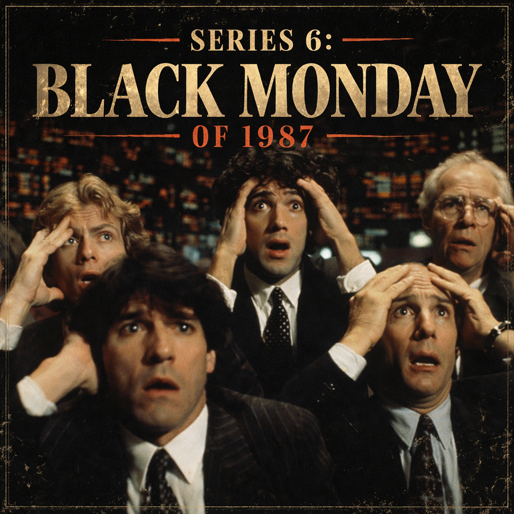

# 1987년 블랙 먼데이 리서치 팩

작성일: 2026-04-18
증보일: 2026-04-26
용도: `06 Black Monday 1987` 시리즈 본문 재집필용 고증 메모

이 리서치 팩의 핵심 관점은 하나다. 1987년 10월 19일은 단순한 폭락장이 아니라 **현대 금융시장의 세 가지 층위가 동시에 시험받은 첫 사건**이었다. 첫째, 플라자 합의와 루브르 합의 이후의 국제 통화 공조가 흔들렸다. 둘째, 프로그램 매매와 포트폴리오 인슈어런스가 현물 주식시장과 선물시장을 사실상 하나의 시장으로 묶었다. 셋째, 주문 처리, 결제, 마진콜, 은행 신용라인 같은 배관이 가격 붕괴와 상호작용했다. 따라서 본문은 "갑자기 주가가 많이 빠졌다"가 아니라 "안전장치와 시장 배관이 동시에 가격을 밀어낸 날"로 써야 한다.

---

## 1. 핵심 1차·준1차 자료

### Federal Reserve History — Stock Market Crash of 1987

- 주소: <https://www.federalreservehistory.org/essays/stock-market-crash-of-1987>
- 사용처: 서문, 프롤로그, Fed 대응, 현대 위기관리의 출발점.
- 핵심 포인트:
  - 1987년 10월 19일을 "the first contemporary global financial crisis"로 설명한다.
  - 다우존스 산업평균은 하루에 508포인트, 22.6% 하락했다.
  - 1987년 8월 말까지 다우는 7개월 만에 약 44% 상승해 버블 우려를 키웠다.
  - 10월 14일부터 무역적자 발표, 달러 약세, 금리 상승 우려가 겹치며 하락이 시작됐다.
  - 10월 16일 금요일에는 옵션·선물 만기와 겹치는 "트리플 위칭"이 있었다.
  - 10월 20일 아침 그린스펀의 짧은 성명은 중앙은행이 유동성을 공급하겠다는 공개 신호였다.
  - 10대 뉴욕 대형은행의 증권사 대출이 10월 19일 주간에 거의 두 배로 늘었다는 Bernanke/Garcia 계열의 후속 연구를 소개한다.

### Mark Carlson, Federal Reserve FEDS 2007-13

- 주소: <https://www.federalreserve.gov/pubs/feds/2007/200713/index.html>
- 논문명: *A Brief History of the 1987 Stock Market Crash with a Discussion of the Federal Reserve Response*
- 사용처: 거의 모든 장. 특히 시장 미시구조, DOT/SuperDOT, 마진콜, Fed 운용.
- 핵심 포인트:
  - 1987년 폭락의 중요성은 낙폭뿐 아니라 **거래 시스템 자체가 극한 상황에서 망가질 수 있음을 보였다는 점**이다.
  - 1980년대 초중반 주가 상승은 이익 증가보다 빨랐고, PER을 끌어올렸다.
  - 정크본드/LBO 붐은 일부 세제 구조, 특히 차입 이자 비용 공제의 유리함과 연결되어 있었다.
  - 포트폴리오 인슈어런스는 주가가 내려갈수록 주식 비중을 줄이고, 주가가 오를수록 주식 비중을 늘리는 동적 헤지였다.
  - 실제 거래는 주식 현물보다 S&P 500 선물 매도 쪽을 선호했다. 비용이 낮고 고객 주식 자체를 직접 팔 권한이 없는 경우도 있었기 때문이다.
  - 포트폴리오 보험 모델은 계속 업데이트되지 않고 일정 간격으로 돌린 뒤 대량 주문을 냈다. 이 "배치 처리"가 월요일 오전의 주문 폭주와 맞물렸다.
  - DOT 시스템은 대량 주문을 NYSE의 specialist/trading post로 보낼 수 있게 했고, 일정 시간 내 체결 보고가 없으면 기준가 체결 확인을 제공하는 구조였다.
  - 10월 19일 오전 10시에도 S&P 500 구성 종목 95개, 지수 가치의 약 30%가 아직 개장하지 않았다. 다우 30개 종목 중 11개도 늦게 열렸다.
  - 현물 주식의 가격은 늦게 열리고 stale quote가 남아 있는데, 선물시장은 제시간에 열려 훨씬 아래 가격을 찍었다. 이 괴리가 시장 전체의 공포 신호가 됐다.
  - 10월 19일 S&P 500 선물은 29% 하락했다. 주식 현물보다 더 큰 낙폭이었다.
  - 10월 19일 비시장조성자 선물 매도 중 약 40%가 포트폴리오 인슈어런스 관련 매도였다는 브래디 보고서 추정을 인용한다.
  - CME 마진콜은 평상시 평균의 약 10배 규모였다. 이 때문에 결제은행, 뉴욕 은행, 시카고 청산기관 간 신용 연결이 위기의 중심으로 떠올랐다.
  - 10월 20일 Fedwire가 뉴욕-시카고 간 일부 시간대에 장애를 겪었고, OCC 결제도 평소보다 2시간 반 늦어졌다.
  - 연준은 공개 성명, 조기 공개시장조작, 연방기금금리 하락 유도, 국채 대여 규정 완화, 은행에 대한 신용공급 독려, Fedwire 시간 연장 등 여러 수단을 동원했다.

### Brady Report — Presidential Task Force on Market Mechanisms

- 주소: <https://www.sechistorical.org/collection/papers/1980/1988_0101_BradyReport.pdf>
- 발표: 1988년 1월
- 사용처: Chapter 13-16, 특히 "하나의 시장"과 서킷브레이커.
- 핵심 포인트:
  - 1987년 10월 13일 종가부터 10월 19일 종가까지 다우는 769포인트, 31% 하락했다.
  - 미국 주식 시가총액 약 1조 달러가 사라졌다고 추산했다.
  - 10월 19일 하루 다우 하락은 508포인트, 22.6%였다.
  - 보고서의 핵심 진단은 **주식, 주가지수 선물, 주가지수 옵션이 경제적으로는 하나의 시장인데 제도적으로는 별개 시장처럼 관리되었다**는 것이다.
  - 기계적·가격무관 매도는 포트폴리오 인슈어런스, 일부 뮤추얼펀드 환매 대응, 그리고 이를 선행하려는 공격적 기관들의 매도로 이어졌다.
  - 10월 19일 세 포트폴리오 보험사가 주식시장에서는 20억 달러에 조금 못 미치는 매도 프로그램을, 선물시장에서는 주식 가치 환산 28억 달러의 매도를 냈다고 보고했다.
  - 유동성은 평상시에는 충분해 보였지만, 비슷한 전략을 쓰는 기관들이 한 방향으로 몰리자 "illusion of liquidity"였음이 드러났다.
  - 결론 권고: 시장 간 결제·마진·정보 시스템을 조율하고, price limit/trading halt를 포함한 circuit breaker를 만들 것.

### SEC, The October 1987 Market Break

- 원문 카탈로그: <https://elischolar.library.yale.edu/ypfs-documents/8229/>
- 사용처: 브래디 보고서와 함께 크로스체크. 특히 10월 14~20일 시간표, DOT 제한, 개별 종목 정지, specialist 자본 문제.
- 핵심 포인트:
  - 10월 14일 하원 Ways and Means Committee의 M&A 관련 세제 변경안 보도가 takeover candidate 주가 재평가를 촉발했다.
  - 같은 날 상무부의 8월 무역적자가 예상보다 크게 발표되면서 달러 약세와 금리 상승 우려가 강화됐다.
  - 10월 19일 현물 주식시장 개장이 늦어졌고, 지수 산출에 낡은 가격이 섞였다.
  - 선물가격이 현물보다 먼저 급락하자 index arbitrage, portfolio insurance, 일반 매도가 서로를 자극했다.

### NYSE Market-Wide Circuit Breakers FAQ

- 주소: <https://www.nyse.com/publicdocs/nyse/NYSE_MWCB_FAQ.pdf?mod=livecoverage_web>
- 판본: 2026년 2월 v4.0
- 사용처: Chapter 15, Chapter 16, 에필로그.
- 핵심 포인트:
  - 현재 시장 전체 서킷브레이커는 S&P 500 전일 종가 대비 7%, 13%, 20% 하락 기준이다.
  - Level 1과 Level 2는 오전 9시 30분부터 오후 3시 25분까지 발동 가능하며, 최소 15분간 정지한다.
  - Level 3은 어느 시점이든 발동 가능하고, 당일 남은 거래를 종료한다.
  - 옵션시장도 함께 정지된다. 1987년의 핵심 문제였던 "현물은 멈추는데 파생시장이 계속 신호를 내는" 상황을 막기 위한 철학이 담겨 있다.

### University of Toronto G7/G8 Research Group — Plaza/Louvre Accord texts

- Plaza Accord: <https://www.g7.utoronto.ca/finance/fm850922.htm>
- Louvre Accord: <https://www.g7.utoronto.ca/finance/fm870222.htm>
- 사용처: Chapter 5, Chapter 8, Chapter 11.
- 핵심 포인트:
  - 1985년 플라자 합의는 달러가 너무 강했고, 주요 비달러 통화의 질서 있는 절상이 바람직하다는 공조였다.
  - 1987년 루브르 합의는 이미 큰 환율 조정이 있었으므로 주요 통화가 현재 수준 근처에서 안정되어야 한다는 공조였다.
  - 이 둘의 긴장은 1987년 가을 시장의 배경음이다. 미국은 여전히 무역적자를 걱정했고, 독일은 물가와 통화 안정을 중시했다. 시장은 "달러를 더 내릴 것인가, 방어할 것인가"라는 모순된 신호를 가격에 반영했다.

### Met Office — The Great Storm of 1987

- 주소: <https://weather.metoffice.gov.uk/learn-about/weather/case-studies/great-storm>
- 사용처: Chapter 10.
- 핵심 포인트:
  - 1987년 10월 중순 영국 남동부를 강타한 폭풍은 영국에서 최대 100mph급 돌풍, 교통·전력·전화선 피해, 광범위한 혼란을 만들었다.
  - 금융사 관점에서는 단순한 날씨 에피소드가 아니라 런던의 가격 발견과 글로벌 심리 연결망이 흔들린 사건으로 사용할 수 있다.

### NBER — Robert Shiller, Portfolio Insurance and Other Investor Fashions

- 주소: <https://www.nber.org/books-and-chapters/nber-macroeconomics-annual-1988-volume-3/portfolio-insurance-and-other-investor-fashions-factors-1987-stock-market-crash>
- 사용처: Chapter 6, Chapter 13, Chapter 16.
- 핵심 포인트:
  - Shiller는 1987년의 폭락을 순수한 경제 뉴스 반응이 아니라 사회적·심리적 현상으로 보았다.
  - 투자자들은 이미 "crash mentality"에 가까운 상태였고, 가격 하락 자체가 더 큰 가격 하락의 증거로 읽혔다.
  - 본문에서는 "기계만의 폭락"으로 쓰지 말고, 기계적 매도와 인간의 군집 심리가 서로를 강화했다는 방향으로 써야 한다.

### Federal Reserve Bank of Boston — Peter Fortune

- 주소: <https://www.bostonfed.org/publications/new-england-economic-review/1993-issues/issue-march-april-1993/stock-market-crashes-what-have-we-learned-from-october-1987.aspx>
- 사용처: Chapter 3, Chapter 13, Chapter 15.
- 핵심 포인트:
  - Cascade Theory를 정리하면서도 "선물시장이 망가진 것이 아니라 현물 주식시장의 거래 메커니즘이 주문 홍수를 감당하지 못했다"는 해석을 제시한다.
  - stale price와 선물 할인(discount)이 더 큰 매도 신호로 작동했다는 설명이 좋다.
  - 서킷브레이커가 만능 처방은 아니며, 거래정지가 오히려 폐장 공포를 키울 수 있다는 반론도 함께 소개할 수 있다.

### FRED/yfinance 정량 체크

- FRED DGS10: <https://fred.stlouisfed.org/series/DGS10>
- FRED FEDFUNDS: <https://fred.stlouisfed.org/series/FEDFUNDS>
- FRED UNRATE: <https://fred.stlouisfed.org/series/UNRATE>
- yfinance 로컬 조회: `^GSPC`, `^IXIC` 1982-08-01~1988-01-10.
- 사용처: Chapter 4, Chapter 7, Chapter 9, Chapter 14.
- 확인 수치:
  - S&P 500 종가: 1982-08-12 102.42, 1987-08-25 336.77, 1987-10-16 282.70, 1987-10-19 224.84, 1987-10-20 236.83.
  - Nasdaq Composite 종가: 1987-08-25 455.10, 1987-10-16 406.30, 1987-10-19 360.20, 1987-10-20 327.80.
  - 미국 10년물 금리(DGS10): 1987-01-02 부근 7%대 초반에서 1987-10-16 10.23%까지 상승. 10월 20일에는 9.40%로 급락.
  - 월간 실업률: 1982-12 10.8%, 1987-12 5.7%. 1982년 불황 이후 경기 확장이 실제로 강했다는 배경에 사용.

---

## 2. 장별 보강 방향

### 서문·프롤로그

서문은 "2024년을 설명할 때 1987년이 소환된다"에서 출발하되, 1987년을 단순한 원조 폭락이 아니라 **현대 금융시장 구조가 처음으로 자신을 드러낸 날**로 정의한다. 1929년이 과잉신용과 대공황의 서사라면 1987년은 파생상품, 프로그램 매매, 국제 통화 공조, 중앙은행 유동성, 거래소 배관이 한 사건 안에서 같이 등장한 첫 현대적 위기다.

프롤로그는 NYSE 플로어의 소음만으로는 부족하다. "가격이 없다"는 공포를 써야 한다. 어떤 주식은 열리지 않았고, 열린 주식은 늦은 체결보고를 냈으며, 지수는 마지막 거래가를 기계적으로 끌어다 썼다. 그런데 시카고 선물시장은 이미 훨씬 아래 가격을 찍고 있었다. 사람들은 시장이 내려가는 것을 본 것이 아니라, 서로 다른 시장이 서로 다른 현실을 말하는 것을 보았다.

### Chapter 1 — 전화로 주문하던 시대

1987년의 세계는 완전히 아날로그도, 완전히 디지털도 아니었다. 그래서 더 위험했다. 고객은 전화로 주문했고, 브로커는 단말기를 보았고, NYSE는 DOT로 대량 주문을 보냈으며, specialist는 플로어에서 질서를 만들어야 했다. 전자화는 속도를 올렸지만, 정보 투명성은 그 속도를 따라가지 못했다. "빠른 주문 + 느린 가격 발견"이 핵심 문장이다.

보강 소재:
- T+5 주식 결제와 T+1 옵션·선물 결제의 불일치.
- 전화가 먹통이 된 브로커, 확인되지 않은 체결, 한 시간 이상 늦는 체결 보고.
- Nasdaq/OTC 시장에서는 시장조성자가 철수하거나 전화에 응답하지 않는 문제도 있었다.
- 오늘의 투자자가 당연히 보는 실시간 호가·체결·앱 알림은 1987년에는 제도 전체에 균등하게 깔린 기능이 아니었다.

### Chapter 2 — 정크본드와 LBO

정크본드/LBO는 단순한 배경음이 아니라 1987년 주가를 위로 밀어올린 "항상 누군가가 회사를 사줄 것"이라는 옵션 프리미엄이었다. 기업 사냥꾼, greenmail, 차입매수, 이자비용 공제, takeover candidate의 급등을 연결한다. 다만 **RJR Nabisco는 1988년 사건**이므로 "블랙 먼데이 직전 딜"로 쓰면 안 된다. 필요하다면 "블랙 먼데이 이후에도 LBO 시대가 끝나지 않았음을 보여준 뒤늦은 상징"으로만 처리한다.

보강 소재:
- Milken/Drexel은 투자부적격 채권을 "추락한 천사"가 아니라 성장기업·인수금융의 연료로 재포장했다.
- LBO는 주식시장에 회사 전체에 대한 콜옵션을 붙였다. 주가가 실적만으로 설명되지 않고 인수 가능성으로 설명됐다.
- 10월 14일 하원 세제 변경안은 이 프리미엄을 직접 건드렸다. M&A 차입이자, greenmail 과세, takeover candidate 재평가를 연결한다.

### Chapter 3 — 컴퓨터가 처음 월가를 지배하기 시작했다

이 장은 "컴퓨터가 주문을 냈다"에서 끝내지 말고, **컴퓨터가 시장 간 가격 차이를 해석하고 인간보다 빠르게 주문을 보냈는데, 그 주문을 받는 현물시장의 제도는 여전히 사람 중심이었다**는 비대칭을 써야 한다.

보강 소재:
- 1982년 CME의 S&P 500 선물 상장.
- index arbitrage: 선물과 현물의 괴리가 생기면 한쪽을 사고 한쪽을 판다.
- portfolio insurance: 주가 하락 시 선물 매도, 상승 시 선물 매수.
- DOT/SuperDOT는 주문 전송을 자동화했지만, specialist의 가격 발견과 자본은 자동화되지 않았다.
- 프로그램 매매가 원인이냐 아니냐의 논쟁을 소개하되, 결론은 "프로그램 매매 하나가 범인이 아니라, 프로그램 매매가 기존 시장 구조의 약점을 드러냈다"로 잡는다.

### Chapter 4 — 1982년, 모든 것이 시작됐다

1987년을 이해하려면 1982년 바닥에서 시작해야 한다. 1982년 8월 S&P 500은 102.42였고, 1987년 8월에는 336.77까지 올랐다. 단순히 "주가 상승"이 아니라, 볼커의 인플레이션 진압, 금리 하락, 실업률 개선, 레이건 감세·규제완화, 자본시장 낙관론이 한 방향으로 겹친 결과다.

보강 소재:
- 1982년 말 실업률 10.8%, 1987년 말 5.7%.
- 1980년대 초 고금리에서 1987년 초 10년물 7%대까지의 안도.
- 그러나 1987년 들어 10년물이 10%대까지 올라오며 주식 할인율 논리를 흔들었다.
- 강세장은 경제 회복의 결과였지만, 마지막 국면에서는 "이익 성장보다 빠른 가격 상승"이 됐다.

### Chapter 5 — 플라자에서 루브르까지

이 장은 반드시 국제 통화 드라마로 확장해야 한다. 플라자는 "달러를 내려라"였고, 루브르는 "이제 그만 내려라"였다. 그런데 미국 무역적자는 계속 컸고, 독일은 물가와 통화 안정에 예민했으며, 일본은 엔고 이후 내수 부양과 자산가격 상승의 길로 들어가고 있었다. 1987년의 주식 폭락은 뉴욕 플로어에서 벌어졌지만, 배경음은 파리와 본과 도쿄에서 들렸다.

### Chapter 6 — 포트폴리오 인슈어런스

가장 크게 키워야 하는 장. 포트폴리오 인슈어런스는 풋옵션을 사는 것과 비슷한 경제적 효과를 **실제 풋옵션 매수 없이** 만들려는 기술이었다. 이론적으로는 주가가 내려가면 조금씩 팔고, 올라가면 조금씩 산다. 문제는 보험회사가 위험을 떠안은 것이 아니라, 보험 가입자들이 시장에 팔아야 할 주문을 미래로 예약해 둔 구조였다는 점이다.

보강 소재:
- Black-Scholes와 동적 복제(dynamic replication)의 직관.
- "보험"이라는 이름이 만든 심리적 안도.
- 고객 주식을 직접 팔지 않고 선물을 팔 수 있었던 운영상 편의.
- 모델을 실시간이 아니라 일정 간격으로 돌린 뒤 주문을 냈다는 배치 처리 문제.
- 시장 전체가 같은 보험을 들면 보험이 아니라 매도 스케줄이 된다.

### Chapter 7 — 그린스펀의 첫 번째 결정

1987년 8월 취임한 그린스펀은 몇 주 만에 달러, 금리, 주식시장, 물가 신뢰를 동시에 상대해야 했다. 9월 초 할인율 인상은 "인플레이션과 달러 방어"의 신호였지만, 주식시장에는 할인율 상승과 채권 대체수익률 상승의 부담으로 들어갔다.

보강 소재:
- 그린스펀은 위기관리자로 알려지기 전, 먼저 인플레이션 파수꾼으로 신뢰를 보여야 했다.
- 1987년 10월 중순 10년물 10.23%는 주식 밸류에이션에 정면 충격이었다.
- 시장은 Fed가 시장을 구할지, 달러를 지킬지, 물가를 지킬지 알 수 없었다.

### Chapter 8 — 루브르 합의가 흔들리다

여기는 "거시 균열" 장. 루브르 합의는 환율 안정 약속이었지만, 각국 정치경제의 이해관계가 달랐다. 미국은 무역적자와 보호무역 압력을 걱정했고, 독일은 통화 안정과 인플레이션을 걱정했다. 그래서 시장은 "공조가 계속된다"와 "각국이 각자 살 길을 찾는다" 사이에서 흔들렸다.

### Chapter 9 — 10월 14일 수요일

수요일의 방아쇠는 두 개다. 무역적자와 M&A 세제. 무역적자는 달러와 금리를 건드렸고, 세제 변경안은 takeover premium을 건드렸다. 하나는 거시 가격표, 다른 하나는 1980년대 주식시장 서사의 핵심 프리미엄이었다. 그래서 그날 하락은 단순한 나쁜 뉴스 반응이 아니라, 1982~1987년 강세장의 두 기둥이 동시에 흔들린 사건으로 써야 한다.

### Chapter 10 — 영국의 폭풍

이 장은 좋은 장면이 될 수 있다. 10월 16일 영국 남동부는 물리적 폭풍을 맞았다. 전화선과 전력, 교통이 흔들렸다. 런던의 가격 발견은 정상적으로 작동하기 어려웠다. 그리고 바로 그날 미국에서는 트리플 위칭과 주간 9%대 하락이 겹쳤다. 세계 금융시장이 하나로 연결되기 시작한 시대에, 자연재해 하나도 가격 발견의 지연과 심리적 불안을 만들 수 있었다.

### Chapter 11 — 일요일 밤의 한마디

Baker 발언은 "단독 원인"처럼 쓰면 과하다. 그러나 주말 동안 누적된 공포 위에 달러를 더 떨어뜨릴 수 있다는 신호가 얹혔다는 점은 중요하다. 월요일 뉴욕 개장 전 아시아 시장이 이미 흔들렸고, 미국 투자자는 외국 시장을 보며 자신의 월요일을 예감했다.

주의:
- 1987년에는 오늘 같은 전자식 일요일 야간 S&P 500 선물장이 존재하지 않았다. "일요일 밤 선물이 열렸다" 식으로 쓰면 안 된다. 대신 환율, 해외시장, 월요일 아침 선물시장, 전화·뉴스망을 통해 압력이 넘어왔다고 표현한다.

### Chapter 12 — 10월 19일 월요일

시간표를 더 촘촘히 써야 한다. 핵심은 "개장했는데 열리지 않은 시장"이다. NYSE는 문을 열었지만 많은 종목은 가격을 만들지 못했고, 시카고 선물은 이미 아래를 가리켰다. 지수는 stale quote를 포함했고, 선물은 공포를 실시간으로 보여줬다. 그 괴리가 주문을 낳고, 주문이 괴리를 더 키웠다.

보강 소재:
- 오전 10시에도 S&P 500 구성 종목 95개가 미개장.
- 다우 30개 중 11개가 늦게 개장.
- SEC 의장의 임시 거래정지 발언 보도가 오후 1시 이후 폐장 루머를 만들었다.
- 막판 90분에 하락이 더 가팔라졌다.
- 체결 보고 지연, 주문 미확인, specialist 자본 소진.

### Chapter 13 — 기계는 멈추지 않았다

이 장은 브래디 보고서의 "one market"을 중심에 둔다. 1987년 이전 제도는 현물, 선물, 옵션을 별개 시장으로 관리했다. 그러나 전략과 자본은 이미 하나의 시장처럼 움직였다. 가격은 선물에서 현물로, 현물에서 옵션으로, 다시 선물로 흘렀다. 제도는 칸막이였고, 위험은 칸막이를 무시했다.

### Chapter 14 — 왜 회복이 달랐나

1987년은 1929년과 달리 은행 위기로 번지지 않았다. 이유는 단순히 "연준이 잘했다"가 아니라, 실물경제와 은행 시스템의 상태, 중앙은행의 공개 신호, 은행 신용공급, 기업 자사주 매입, 결제망 유지가 겹쳤기 때문이다. 특히 10월 20일의 진짜 공포는 주가가 아니라 **청산기관과 증권사의 결제 실패 가능성**이었다.

### Chapter 15 — 서킷브레이커의 탄생

브래디 보고서의 권고를 설명하되, 서킷브레이커를 단순한 "폭락 방지 장치"로 쓰면 안 된다. 본질은 시간을 사는 것이다. 가격을 올리는 장치가 아니라, 서로 다른 시장이 같은 충격을 처리할 시간을 맞추는 장치다.

주의:
- 현재 규정은 S&P 500 기준 7/13/20%.
- Level 1·2는 3:25 p.m. 이후에는 새로 발동하지 않는다는 시간 조건을 반영한다.
- 1987년에 현재 규정이 있었다면 어떤 낙폭에서 정지됐을지를 가정할 수 있지만, 실제 결과를 단정하지 말 것.

### Chapter 16 — 지금도 작동하는 룰들

현재와 연결할 때는 너무 일반론으로 흐르지 말고 1987에서 뽑은 구체적 룰을 유지한다.

1. 안전장치는 시장 전체에서는 매도 스케줄이 될 수 있다.
2. 유동성은 평상시 평균이 아니라 스트레스 시 동시수요로 봐야 한다.
3. 시장은 기술적으로 연결되기 전에 경제적으로 먼저 연결된다.
4. 정책 공조는 숫자보다 신뢰의 문제다.
5. 정보 지연은 가격 변동만큼 위험하다.
6. 중앙은행의 말은 돈만큼 중요할 수 있지만, 그 말은 결제망과 은행 신용이라는 실제 배관으로 이어져야 한다.

### 에필로그

2024년과 연결하되, 2024년의 빠른 회복이 1987년보다 단순히 "현대 시장이 더 좋다"는 뜻으로 읽히지 않게 한다. 1987년 이후 제도는 좋아졌지만, 위험은 다른 곳으로 이동했다. 당시에는 포트폴리오 인슈어런스가 불투명했고, 오늘은 옵션 딜러 감마, ETF 유동성, 볼타깃, 리스크패리티, 캐리 트레이드, AI 기반 체결 알고리즘이 비슷한 구조를 만들 수 있다.

---

## 3. 확인·수정해야 할 기존 원고 포인트

- "RJR Nabisco가 블랙 먼데이 직전 발표된 딜"이라는 식의 문장은 사용하지 말 것. RJR Nabisco LBO는 1988년의 상징이다.
- "일요일 밤 S&P 500 선물이 열렸다"는 식의 표현은 피할 것. Globex는 1992년 이후의 전자거래 인프라다. 1987년에는 해외시장·환율·월요일 아침 선물장으로 압력이 전달됐다.
- 포트폴리오 인슈어런스를 단독 범인으로 쓰지 말 것. 브래디 보고서와 Fed 논문 모두 "중요했지만 단독 설명은 아니다"라는 균형을 취한다.
- 서킷브레이커를 폭락 방지 장치로 과장하지 말 것. 정보 소화, 결제·마진·시장 간 조율 시간을 확보하는 장치로 설명한다.
- 1987년 이후 VIX가 바뀌었다고 쓰면 안 된다. VIX는 1993년 도입이므로, 1987년에는 S&P 100 옵션의 implied volatility나 사후적으로 구성된 변동성 지표를 언급한다.
- 2024년과 비교할 때 "37년 만" 등 상대 연도 표현은 독자가 읽는 시점에 따라 흔들릴 수 있으므로, 가능하면 `1987년 10월 19일`, `2024년 8월 5일`처럼 절대 날짜를 병기한다.

---

## 4. 본문에 넣기 좋은 짧은 인용·표현

저작권 제한과 문체 일관성을 위해 원문 장문 인용은 피하고, 대부분 한국어 의역으로 처리한다.

- Fed 성명 핵심 문장: "source of liquidity to support the economic and financial system" 정도만 짧게 원문 병기 가능.
- 브래디 보고서의 핵심 의역: "주식, 주가지수 선물, 주가지수 옵션은 경제적으로 하나의 시장이었다."
- Fed 논문의 핵심 의역: "시스템은 그 많은 거래를 한꺼번에 처리할 수 없었고, 정보 불확실성이 투자자를 시장에서 물러나게 했다."
- Boston Fed의 핵심 의역: "선물시장이 실패했다기보다, 현물 주식시장의 거래 메커니즘과 가격 정보 지연이 futures discount를 만들었다."
- Shiller의 핵심 의역: "투자자들은 특정 뉴스보다 가격 움직임 자체에 반응했다."

---

## 5. 장기 연결선

1987년은 이후 시리즈와 연결되는 노드가 많다.

- 1929: 폭락 규모의 비교 대상. 그러나 1987년은 은행공황으로 번지지 않았다는 차이를 강조.
- 1998 LTCM: 동질적 모델과 레버리지, 중앙은행 중재.
- 2000 닷컴 버블: "이야기 밖의 폭탄"과 밸류에이션.
- 2008 금융위기: 유동성 환상, 결제·담보·은행 신용망의 중요성.
- 2020 코로나: 서킷브레이커 실제 발동과 중앙은행의 공개 유동성 약속.
- 2024 블랙 먼데이: 캐리 트레이드/기계적 포지션 청산과 1987년의 비교.

---

## 6. 이번 재집필의 목표 문장

이번 증보판은 아래 문장을 증명하는 방향으로 써야 한다.

> 1987년 10월 19일, 주식시장은 단지 가격이 폭락한 것이 아니라 자신이 이미 하나의 전자적·파생상품적·글로벌 시스템이 되었음을 알아차렸다. 문제는 그 시스템을 움직이는 전략은 21세기형이었는데, 그것을 감당하는 배관과 규칙은 아직 20세기식이었다는 점이었다.
