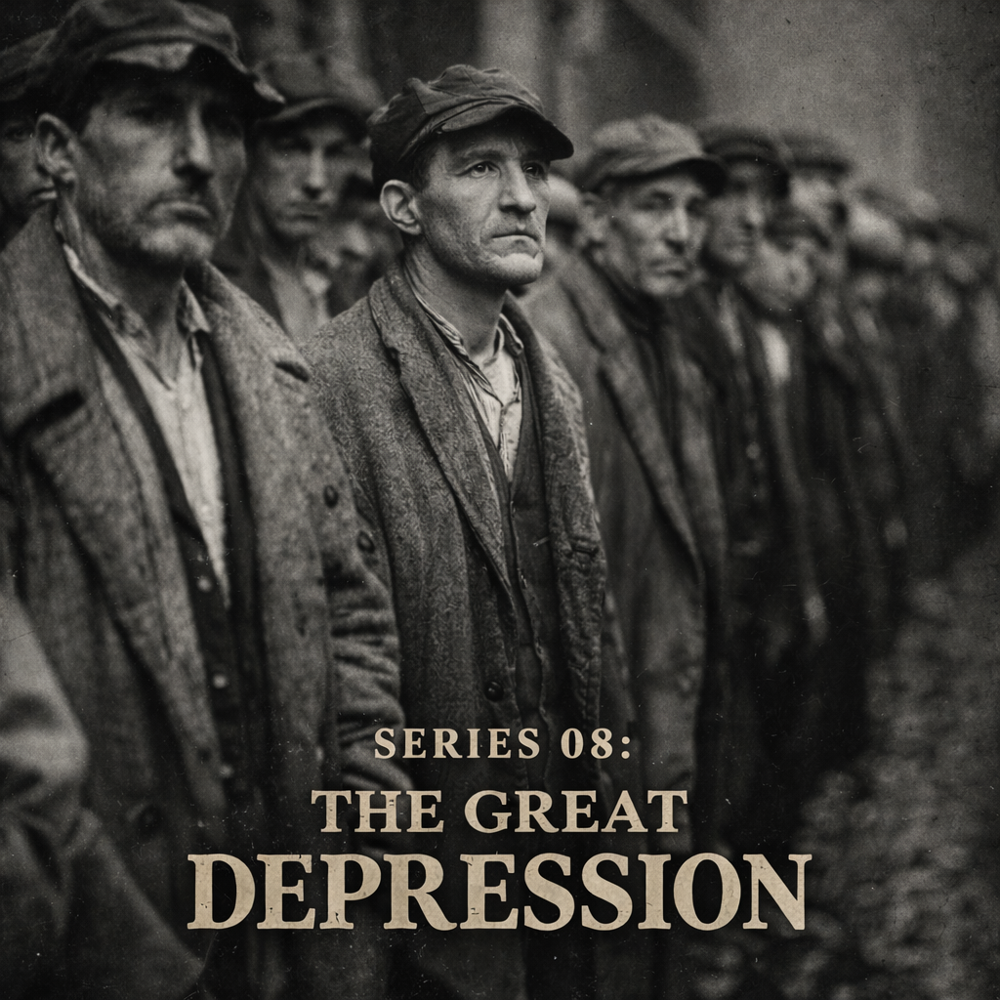

# Part 3 — 목요일 아침
# Chapter 10 — 은행들이 하나씩 쓰러졌다

1930년 12월 11일.

뉴욕 브롱크스에 있는 뱅크 오브 유나이티드 스테이츠(Bank of United States)가 문을 닫았습니다.

이름이 거창했습니다. "미합중국 은행." 마치 미국 정부와 관련된 공공 기관처럼 들렸습니다. 그러나 그것은 이름뿐이었고, 1913년에 설립된 민간 상업은행이었습니다.

예금자 수는 약 40만 명. 예금 총액은 당시 기준으로 약 2억 달러. 이 은행이 하루아침에 문을 닫았습니다. 40만 명의 예금자가 그날로 돈에 접근할 수 없게 됐습니다.

당연히 뱅크런이 먼저였습니다. 은행이 어렵다는 소문이 돌자 예금자들이 창구 앞에 줄을 섰습니다. 그 줄을 보고 더 많은 사람이 몰렸습니다. 은행은 지급할 현금이 충분하지 않았습니다. 결국 문을 닫았습니다.

이 은행의 이름은 공포를 더 키웠습니다. "Bank of United States"라는 이름을 들은 많은 이민자 예금자들은 그것이 정부와 관련된 은행이라고 믿었습니다. 미국이라는 나라 자체가 보증해주는 은행처럼 들렸습니다. 그래서 문을 닫았을 때 충격은 단순한 지역 은행 파산보다 컸습니다. 정부 이름처럼 들리는 은행도 문을 닫는다면, 도대체 어느 은행을 믿어야 한단 말입니까.

비슷한 시기 남부에서는 Caldwell & Company의 붕괴가 지역 금융망을 흔들었습니다. 테네시주 내슈빌의 투자은행이자 금융그룹이 무너지면서 연결된 은행들이 함께 압박을 받았습니다. 대공황의 은행위기는 한 개의 거대한 은행이 무너진 이야기가 아니라, 지역마다 다른 이름을 가진 수천 개의 작은 붕괴가 서로를 전염시킨 이야기였습니다.

뱅크 오브 유나이티드 스테이츠의 창구 앞에 선 사람들을 생각해 봅시다. 많은 예금자는 이민자였고, 영어 금융 용어에 익숙하지 않았습니다. 그들에게 은행 이름은 하나의 약속처럼 들렸습니다. "미합중국"이라는 단어가 붙은 은행이라면 안전할 것 같았습니다. 은행은 이름으로도 신뢰를 팔 수 있습니다. 그런데 그 이름이 무너졌습니다. 공황에서 상징은 실제 손실만큼 강합니다. 이름이 안전을 암시했기 때문에, 그 붕괴는 다른 은행 이름들까지 의심하게 만들었습니다.

Caldwell & Company의 붕괴는 또 다른 얼굴이었습니다. 뉴욕의 대형 은행 하나가 아니라, 남부 지역의 투자은행과 보험, 지방 은행, 지방채 발행이 얽힌 네트워크가 흔들린 사건이었습니다. 지역 사회에서 은행은 단순한 예금 창구가 아니었습니다. 농민의 대출, 도시의 공공사업, 상인의 운영자금, 지방정부의 채권이 한데 묶여 있었습니다. 한 금융그룹이 무너지면, 그 그룹과 거래한 작은 은행들이 동시에 의심받았습니다. 은행위기는 이렇게 지역의 신용 생태계를 뜯어냈습니다.

---

이 사건을 이해하려면 한 가지를 먼저 알아야 합니다.

**예금보험이 없었습니다.**

지금 우리가 은행에 돈을 맡길 때 걱정을 크게 하지 않는 이유가 있습니다. FDIC(연방예금보험공사)가 있기 때문입니다. 미국의 경우 은행이 파산해도 계좌당 25만 달러까지 예금이 보장됩니다. 한국의 경우 예금자보호법으로 5,000만 원까지 보호됩니다.

1933년 이전 미국에는 이런 제도가 없었습니다.

은행이 망하면 예금자가 모두 잃었습니다. 20년 동안 모은 저축이 하루아침에 사라질 수 있었습니다. 그것이 법적으로 가능한 세계였습니다.

이 세계에서 은행 창구는 단순한 서비스 창구가 아니었습니다. 그것은 생존 순서표였습니다. 먼저 온 사람은 현금을 받을 가능성이 있고, 늦게 온 사람은 문이 닫힌 뒤 안내문만 볼 수 있습니다. 은행은 고객의 예금을 금고 안에 전부 보관하지 않습니다. 예금 일부를 현금으로 두고, 나머지는 대출과 채권으로 운용합니다. 평상시에는 이것이 정상입니다. 모두가 동시에 찾으러 오지 않기 때문입니다. 그러나 모두가 동시에 오면, 건전한 은행도 버틸 수 없습니다.

따라서 뱅크런은 "사람들이 은행의 원리를 몰라서"가 아니라, 오히려 그 원리를 너무 잘 감지했기 때문에 일어났습니다. 은행은 신뢰 위에서 움직입니다. 신뢰가 남아 있을 때는 예금자가 차례로 찾고, 은행은 대출을 유지할 수 있습니다. 신뢰가 깨지면 모든 예금자는 자기 차례를 앞당기려 합니다. 금융 시스템의 안정은 자주 도덕이나 인내심이 아니라, 줄을 설 필요가 없다는 제도적 확신에 달려 있습니다.

---

이 세계에서 다음 논리가 성립합니다.

이웃 동네의 은행이 파산했다는 뉴스가 나왔습니다. 내 은행도 불안합니다. 어떻게 해야 할까요.

두 가지 선택지가 있습니다.

첫째, 기다린다. 내 은행이 건전하다면 아무 일 없을 것이다.

둘째, 지금 당장 가서 인출한다.

여기서 중요한 것: 두 번째 선택이 합리적입니다. 만약 은행이 정말 튼튼하다면 내가 인출해도 아무 문제가 없습니다. 그러나 만약 은행이 위험하다면, 빨리 인출할수록 내 돈을 건질 가능성이 높습니다. 늦으면 못 찾을 수도 있습니다.

그러니 의심이 조금이라도 생기면 가서 인출하는 것이 합리적입니다.

그런데 모든 예금자가 동시에 이 합리적인 판단을 실행하면 어떻게 됩니까.

은행이 망합니다.

뱅크런은 비합리적인 공황이 아니었습니다. 예금보험이 없는 세계에서의 완벽하게 합리적인 행동이었습니다. 그 합리적인 행동들이 합쳐져서 재앙을 만들었습니다.

*[2026 독자를 위한 설명: 1권 《2008년 금융위기》에서 다룬 머니마켓 펀드(MMF)의 런이 이것과 같은 구조입니다. Reserve Primary Fund가 1달러 순자산가치를 밑돌자 전국의 MMF에서 돈이 빠져나갔습니다. 아직 문제가 없는 MMF에서도. 이유는 같습니다. "만약 문제가 생기면 늦으면 늦을수록 손해"라는 논리. 예금보험이 있는 일반 예금과 달리, MMF에는 그런 보장이 없었습니다.]*

---

은행 파산의 숫자를 보겠습니다.

- 1929년: 659개
- 1930년: 1,350개
- 1931년: 2,293개
- 1932년: 1,453개
- 1933년 3월 초: 전국 은행 시스템이 사실상 붕괴 직전

1929년부터 1933년 초까지 약 9,000개의 은행이 파산했습니다. 전체 미국 은행의 약 40%가 사라졌습니다.

40만 명의 예금자가 하루아침에 돈을 잃은 사례가 9,000번 반복됐습니다.

"9,000개"라는 숫자는 너무 커서 오히려 감각을 무디게 만듭니다. 그러나 한 은행의 파산은 한 동네의 달력을 바꿉니다. 결혼 자금이 사라지고, 가게의 재고 대금이 사라지고, 농부가 종자와 비료를 살 돈이 사라집니다. 학교 교사의 저축도, 장례비로 모아둔 돈도, 작은 공장의 급여 계좌도 한 은행 장부 안에 들어 있습니다. 은행 하나가 닫히면 그 돈을 기다리던 여러 개의 약속이 동시에 깨집니다.

그 약속의 붕괴가 다른 은행으로 번졌습니다. 한 도시의 사람들이 은행 앞에서 울고 있는 모습을 본 이웃 도시는 자기 은행을 떠올렸습니다. "우리 은행도 저렇게 될 수 있다." 이 질문만으로도 충분했습니다. 공황은 실제 부실보다 빠르게 움직입니다. 실제로 안전한 은행도 의심의 속도를 이기지 못하면 위험해집니다.

---

은행 파산이 왜 그렇게 많이 일어났습니까.

먼저 미국 은행 구조의 특수성을 알아야 합니다.

당시 미국에는 단위 은행(unit banking) 체계가 있었습니다. 각 주(state)에서 은행의 지점 설치를 엄격하게 제한했습니다. 어떤 주에서는 한 카운티 안에서만 지점을 낼 수 있었습니다. 그 결과 미국에는 수만 개의 소규모 지역 은행들이 있었습니다.

이 소규모 은행들은 자산 규모가 작았습니다. 지역 경제에 집중됐습니다. 농업 지역 은행은 농업 대출이 많았습니다. 농산물 가격이 떨어지면 그 은행의 대출이 부실해졌습니다.

그리고 규모가 작으니 뱅크런에 취약했습니다. 예금자 수백 명이 동시에 오면 현금이 바닥났습니다.

단위 은행 제도는 미국적 정치문화와도 관련이 있었습니다. 큰 전국 은행에 지역 돈이 빨려 들어가는 것을 싫어했고, 지역 공동체가 자기 은행을 갖는 것을 선호했습니다. 작은 은행은 지역 사정을 잘 알고, 농민과 상인의 얼굴을 알았습니다. 평상시에는 그것이 장점이었습니다. 그러나 위기에는 치명적 약점이 됐습니다. 지역 경제가 한꺼번에 나빠지면 은행도 함께 나빠졌기 때문입니다.

캐나다처럼 지점망이 넓은 은행 체계를 가진 나라와 비교하면 차이가 더 분명해집니다. 전국 지점망을 가진 은행은 한 지역의 손실을 다른 지역의 수익으로 흡수할 수 있습니다. 그러나 미국의 작은 단위 은행은 지역 농산물 가격, 지역 부동산, 지역 상인의 매출에 너무 많이 묶여 있었습니다. 지역 전체가 흔들리면 은행도 피할 곳이 없었습니다. 분산되지 않은 지역 친밀성이 위기에는 집중 위험으로 바뀐 것입니다.

---

은행 파산은 연쇄 반응을 만들었습니다.

한 은행이 망하면 그 은행에 예금을 맡긴 기업들이 피해를 입었습니다. 그 기업들이 직원을 해고하거나 거래처에 대금을 못 냈습니다. 그 거래처 은행도 부실 대출이 늘었습니다. 그 은행도 위험해졌습니다. 예금자들이 빼기 시작했습니다.

이것이 농촌에서 시작해 도시로 번졌습니다. 작은 은행에서 큰 은행으로 번졌습니다.

연준이 무엇을 해야 했습니까.

1907년의 경험이 있었습니다. 그때 JP모건이 민간에서 했던 것처럼, 위기에 처한 은행들에 유동성을 공급해야 했습니다. 최후의 대부자(Lender of Last Resort) 역할을 해야 했습니다. 연준은 바로 그 역할을 위해 만들어진 기관이었습니다.

그러나 연준은 하지 않았습니다.

왜 하지 않았는지는 다음 파트에서 자세히 다루겠습니다. 간단히 말하면, 연준은 다른 것을 우선시했습니다. 금본위제 수호. 그리고 그 선택이 대공황을 심화시켰습니다.

---

1933년 3월 4일, FDR이 대통령으로 취임했습니다.

취임 전날 밤, 38개 주에서 은행들이 자체적으로 문을 닫았습니다. 주지사들이 긴급 명령을 내려서 은행 영업을 정지시킨 것이었습니다. 이유는 하나였습니다. 열어놓으면 다음날 뱅크런으로 망한다. 그러니 아예 닫아버리는 것이 낫다.

대통령이 취임하는 날, 미국의 은행 시스템이 거의 멈춰 있었습니다. 현금을 찾을 수 없었습니다. 수표가 제대로 기능하지 않았습니다. 뉴욕 같은 대도시에서도 가게들이 신용을 받아주지 않았습니다.

그것이 FDR이 취임 다음 날 전국 은행 강제 휴업(Bank Holiday)을 선언한 배경이었습니다.

이 시점의 미국은 돈이 사라진 나라처럼 보였습니다. 실제로 돈이 전부 사라진 것은 아니었습니다. 그러나 돈을 움직이는 장치가 멈췄습니다. 수표를 받아도 상대 은행이 열려 있는지 알 수 없고, 은행이 닫혀 있으면 급여를 지급하기 어렵고, 상점은 외상 거래를 줄입니다. 현금은 집 안 서랍과 금고로 숨고, 숨은 현금은 다시 거래를 줄입니다. 은행 시스템이 멈춘다는 것은 단지 금융기관 몇 곳이 쉬는 것이 아니라, 경제의 혈액순환이 느려지는 일입니다.

FDR의 은행휴업은 그래서 이상한 처방이었습니다. 모두가 은행이 닫힐까 두려워하는데, 정부가 아예 은행을 닫았습니다. 그러나 차이가 있었습니다. 공포 속의 폐쇄는 무질서한 폐쇄였고, 정부의 휴업은 심사와 재개장을 전제로 한 폐쇄였습니다. "닫았다"는 사실보다 "누가, 왜, 언제 다시 열 것인가를 결정한다"는 사실이 중요했습니다. 공황의 무작위성을 정부의 절차로 바꾼 것입니다.

---

1933년 이후, 루즈벨트는 FDIC를 만들었습니다.

연방예금보험공사. 은행이 파산해도 예금자의 예금을 일정 한도 내에서 보장하는 제도.

이것이 만들어지자 뱅크런이 구조적으로 막혔습니다. 내 은행이 망해도 내 돈이 보장된다면, 불안하다고 해서 뛰어가서 인출할 이유가 없습니다. 개인의 합리적인 행동이 집단 재앙으로 이어지는 연결 고리를 끊은 것입니다.

FDIC의 첫 보험 한도는 2,500달러였습니다. 오늘의 기준으로 보면 작아 보이지만, 당시 많은 보통 예금자에게는 충분히 큰 보호였습니다. 이 한도는 모든 위험을 없애지 않았습니다. 큰 예금자와 기업 계좌는 여전히 불안을 느낄 수 있었습니다. 그러나 은행 창구 앞 줄을 만드는 핵심 집단, 즉 평생 모은 소액 예금을 지키려는 가계의 행동을 바꾸는 데는 충분했습니다. "내가 먼저 가야 한다"는 압박이 줄어든 것입니다.

제도의 힘은 여기서 보입니다. 사람들에게 침착하라고 설교하는 것보다, 침착해도 손해 보지 않는 구조를 만드는 것이 더 강합니다. 1930년대 이전의 정책은 자주 공포를 도덕의 문제로 다뤘습니다. 겁먹지 말라. 은행을 믿어라. 그러나 예금보험이 없는 세계에서 그런 말은 설득력이 약했습니다. FDIC는 신뢰를 말로 요구하지 않고 계약으로 제공했습니다. 그래서 뱅크런의 행동 방정식이 바뀌었습니다.

FDIC는 지금도 존재합니다. 그 이후 미국에서 뱅크런으로 인한 대규모 은행 파산 사태가 반복되지 않은 것은, 우연이 아닙니다.

---

대공황에서 배운 교훈이 제도로 만들어진 대표적인 예가 FDIC입니다.

그리고 이것이 대공황의 역설적인 유산입니다.

너무 많은 것이 무너졌기 때문에, 그 무너진 자리에 더 견고한 구조물을 세울 수 있었습니다. 고통은 컸지만, 그 고통이 없었다면 만들어지지 않았을 제도들이 생겼습니다.

FDIC만이 아닙니다. SEC(증권거래위원회), 사회보장제도, 최저 임금법. 이것들이 모두 대공황 이후 만들어졌습니다.

그리고 이 제도들은 이후의 모든 위기에서 대공황의 재발을 막는 안전망이 됐습니다.
