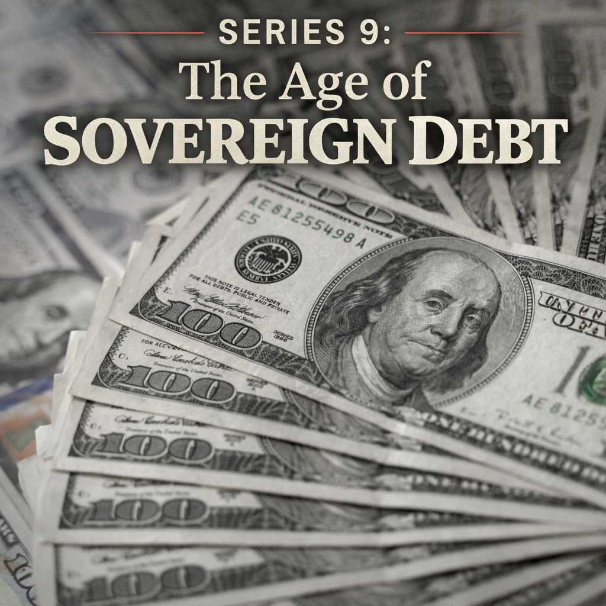

# 프롤로그: 2011년 8월, 그 여름

2011년 8월 5일 금요일 저녁, 미국 동부 시각으로 오후 8시 직후였습니다.

신용평가사 S&P가 보도자료 하나를 배포했습니다. 미국의 국가 신용등급을 AAA에서 AA+로 강등한다는 내용이었습니다.

미국이 최고 신용등급을 잃은 것은 1941년 이후 70년 만에 처음이었습니다. S&P는 이렇게 설명했습니다. "미국의 재정 건전화 계획이 중기 부채 역학을 안정시키기에 충분하지 않다고 판단한다." 그 주 초, 미국 의회는 부채한도 협상을 마지막 순간까지 끌다가 간신히 합의를 이뤄냈습니다. 디폴트 직전까지 갔다가 돌아온 것이었습니다. S&P는 그 정치적 혼란을 보고 더 이상 미국을 최고 등급으로 신뢰하기 어렵다고 판단했습니다.

그 주말, 전 세계 금융인들은 월요일 장 시작을 두려워했습니다.

금요일 밤의 신용등급 강등은 이상한 시간에 도착한 편지 같았습니다. 주식시장은 이미 닫혔고, 채권 데스크도 대부분 주말로 들어간 뒤였습니다. 그러나 금융시장은 완전히 잠들지 않습니다. 뉴욕의 보도자료는 곧 런던과 홍콩, 싱가포르의 전화와 메시지로 번졌습니다. 포트폴리오 매니저들은 월요일 아침에 무엇을 팔아야 할지, 위험관리팀은 어떤 한도를 줄여야 할지, 은행 트레이더들은 고객 주문이 어느 방향으로 몰릴지 계산했습니다.

신용등급은 종이 위의 기호입니다. AAA, AA+, A. 그러나 그 기호가 담보 규정과 투자지침, 파생상품 계약과 펀드의 내부 규칙에 들어가면 기호는 실제 힘을 갖습니다. 어떤 기관은 최고등급 채권만 살 수 있고, 어떤 담보 계약은 등급 변화에 따라 추가 증거금을 요구할 수 있습니다. 미국이 AA+가 됐다는 것은 단순한 체면 손상이 아니라, 전 세계 금융계약의 작은 글씨들을 다시 들여다보게 하는 사건이었습니다.

그런데 더 이상한 점은 아무도 미국 국채를 완전히 대체할 자산을 떠올릴 수 없었다는 것입니다. 독일 국채시장은 너무 작았고, 일본은 이미 높은 부채와 저성장에 갇혀 있었으며, 금은 이자를 주지 않았습니다. 세계에서 가장 큰 안전자산이 신용등급을 잃었는데, 세계는 여전히 그 안전자산 안으로 피신해야 했습니다. 이 역설이 2011년 8월의 핵심이었습니다.

---

그런데 이미 그 전 3주가 끔찍했습니다.

7월 말부터 유럽발 공포가 시장을 짓누르고 있었습니다. 무대는 이탈리아였습니다. 그리스, 아일랜드, 포르투갈은 이미 유럽연합과 IMF의 구제금융을 받고 있었습니다. 그 나라들은 작았습니다. 유럽연합이 어떻게든 감당할 수 있는 규모였습니다. 그런데 이탈리아는 달랐습니다. 이탈리아의 국채 잔액은 약 1조 9천억 유로였습니다. 유로존 GDP의 7분의 1을 차지하는 나라였습니다. 만약 이탈리아가 흔들리면 누가 구해줄 수 있겠습니까. 유럽안정화기금의 전체 규모가 이탈리아 국채의 3분의 1도 되지 않았습니다.

7월 중순부터 이탈리아 10년물 국채 금리가 오르기 시작했습니다. 6%를 넘었습니다. 시장에서는 7%를 "돌아올 수 없는 선"이라고 불렀습니다. 그리스 국채 금리가 7%를 넘겼을 때 구제금융이 불가피해졌습니다. 아일랜드도, 포르투갈도 그랬습니다. 그런데 이탈리아는 구제할 수가 없었습니다. 너무 컸습니다.

8월 첫 주, 공포 지수 VIX는 40을 넘어 48까지 치솟았습니다. 2020년 코로나 폭락 때 85까지 올랐던 것에 비하면 낮아 보이지만, 당시로서는 2008년 금융위기 이후 최고 수준이었습니다. S&P 500은 3주 만에 17% 가까이 빠졌습니다.

그리고 8월 5일 밤, S&P의 강등 소식이 왔습니다.

---

그 주말을 기억하는 사람들은 말합니다. 뉴스를 보면서도 실감이 나지 않았다고.

미국이 AAA를 잃었다는 것이 도대체 무슨 의미인지, 월요일 아침 시장이 어떻게 반응할지, 아무도 확신할 수 없었습니다. 전례가 없었습니다. 경제사 교과서에는 이런 상황을 위한 챕터가 없었습니다. 세계에서 가장 안전하다고 여겨지는 자산의 발행국이 등급을 잃으면 어떤 일이 벌어지는가. 이론으로만 존재했던 질문이 현실이 됐습니다.

미국 재무부는 그 주말 내내 S&P와 접촉하며 계산 오류를 주장했습니다. S&P가 2조 달러의 수치를 잘못 계산했다는 것이었습니다. S&P는 그것을 인정했지만 결정을 바꾸지 않았습니다. 숫자가 문제가 아니라 정치적 기능 장애가 문제라는 입장이었습니다. 의회가 디폴트 직전까지 치닫다가 마지막 순간에야 협의한 나라를 어떻게 최고 등급으로 평가할 수 있느냐는 것이었습니다.

버락 오바마 대통령은 그 주말 내내 침묵했습니다. 보좌관들이 대통령의 발언이 시장에 더 큰 혼란을 줄 수 있다고 판단했기 때문이었습니다. 세계 최강국의 대통령이 말을 할 수 없는 주말이었습니다.

---

월요일인 8월 8일 아침, 시장은 예상대로 열리자마자 급락했습니다. S&P 500이 하루에 6.7% 떨어졌습니다. 그런데 기묘한 일이 일어났습니다. 투자자들은 미국 국채를 팔지 않았습니다. 오히려 샀습니다. 미국의 신용등급이 강등됐는데, 미국 국채로 돈이 몰린 것입니다.

10년물 미국 국채 금리는 그날 2.3%대까지 떨어졌습니다. 채권 가격이 오르면 금리가 내려갑니다. 즉 투자자들이 국채를 사들였다는 뜻입니다. 등급이 강등된 나라의 채권을 더 많이 사는 역설이 벌어졌습니다.

이 역설은 두 가지를 말해줍니다.

첫째, 신용등급 강등이 실제 위험 판단보다는 상징적 충격에 가까웠습니다. 투자자들은 이미 미국 국채를 세계에서 가장 안전한 자산으로 취급하고 있었고, S&P의 도장 하나가 그 판단을 바꾸지는 못했습니다.

둘째, 달리 갈 곳이 없었습니다. 유로존은 불타고 있었습니다. 일본은 이미 부채 규모가 GDP의 두 배를 넘고 있었습니다. 영국은 그해 초 긴축 예산으로 사회 갈등이 고조되고 있었습니다. 전 세계가 불안할 때 그나마 가장 덜 불안한 곳이 미국이었습니다. 세계 기축통화를 발행하는 나라의 특권이었습니다.

그 특권이 지금 시험받고 있습니다. 하지만 그 이야기는 나중에 하겠습니다.

2011년의 역설은 그래서 단순한 시장 해프닝이 아니었습니다. 미국의 신용등급이 내려갔는데 미국 국채가 올랐다는 사실은, 현대 금융 시스템이 얼마나 깊게 미국 국채 위에 세워져 있는지를 보여줬습니다. 은행의 유동성 규제, 보험사의 장기부채 매칭, 외환보유액 운용, 담보 시장, 파생상품 증거금, 머니마켓펀드의 현금 관리가 모두 미국채를 기준점으로 삼고 있었습니다. "미국이 흔들리면 미국채를 판다"가 아니라 "세계가 흔들리면 그래도 미국채로 간다"는 구조였습니다.

그러나 이 구조가 미국에게 무한한 면허를 준 것은 아닙니다. 달리 갈 곳이 없다는 말은 아무 가격에나 빌려주겠다는 뜻이 아닙니다. 투자자는 여전히 보상을 요구합니다. 단기적으로는 안전자산 수요가 미국채 금리를 낮출 수 있지만, 장기적으로는 재정 적자와 정치적 기능 장애, 인플레이션 위험이 기간 프리미엄을 밀어 올릴 수 있습니다. 미국의 특권은 위기의 시간을 늦춰줍니다. 동시에 그 시간이 길어질수록 청구서의 규모도 커집니다.

이 책이 2011년 8월에서 출발하는 이유가 바로 여기에 있습니다. 그 주말에는 두 가지 공포가 겹쳤습니다. 하나는 유로존 주변부의 재정위기가 이탈리아로 번지는 공포였고, 다른 하나는 세계의 중심인 미국마저 정치적으로 흔들릴 수 있다는 공포였습니다. 당시에는 두 공포가 서로를 상쇄했습니다. 유럽이 더 불안했기 때문에 미국채가 피난처가 됐습니다. 그러나 만약 다음 위기에서 피난처 자체의 가격이 문제로 떠오른다면 어떨까요. 이것이 2020년대의 질문입니다.

국가 부채가 중심부의 문제가 된다는 말은 미국이나 프랑스, 일본이 내일 당장 그리스처럼 된다는 뜻이 아닙니다. 중심국은 더 큰 세수 기반, 더 깊은 금융시장, 더 강한 중앙은행, 더 긴 정치적 신용을 갖고 있습니다. 바로 그래서 위기는 더 늦게 옵니다. 하지만 늦게 온다는 것은 없다는 뜻이 아닙니다. 오히려 중심국의 위기는 주변국의 위기보다 더 조용히, 더 넓게 가격에 스며듭니다. 장기금리, 환율, 주식 밸류에이션, 주택담보대출, 국방비, 복지 논쟁이 모두 같은 방향으로 조금씩 움직이기 시작합니다.

---

2011년 8월의 위기는 2012년 7월 유럽중앙은행 총재 마리오 드라기의 한 마디로 사실상 봉합됐습니다. 그는 "유로를 지키기 위해 무엇이든 하겠다(whatever it takes)"고 말했고, 시장은 그 말을 믿었습니다. 이탈리아 금리는 내려왔습니다. 스페인 금리도 내려왔습니다. 위기는 가셨습니다.

그 후 10여 년 동안 유럽 주변부의 재정 위기는 점점 기억에서 흐려졌습니다. 그리스는 고통스러운 구조조정을 거치면서 조용히 재건됐습니다. 2018년 그리스는 구제금융 프로그램을 완전히 졸업했습니다. 스페인은 부동산 거품의 폐허에서 일어섰습니다. 아일랜드는 놀라운 속도로 회복해 2013년 이미 시장 복귀에 성공했습니다. 유럽중앙은행은 초저금리 정책과 양적완화로 유로존 전체를 지탱했습니다.

그리스 국채 금리는 2012년 최고점에서 30%를 넘었다가 2019년에는 1%대까지 내려왔습니다. 불과 7년 사이의 일이었습니다. 위기의 진원지였던 나라가 역사적 최저 금리로 돈을 빌리게 됐습니다.

세상은 PIIGS(포르투갈, 이탈리아, 아일랜드, 그리스, 스페인)라는 단어를 거의 쓰지 않게 됐습니다.

---

그 단어를 잊게 만든 것은 무엇이었을까요.

세 가지였습니다.

**첫 번째는 드라기의 무제한 매입 약속이었습니다.** "Whatever it takes." 실제로 국채를 한 장도 사지 않고도 그 선언 하나가 시장을 안정시켰습니다. 중앙은행의 말이 곧 행동이 될 수 있다는, 즉 중앙은행이 원하면 얼마든지 국채를 살 수 있다는 믿음이 시장에 확인됐습니다. 투자자들은 유럽중앙은행에 맞서 싸울 생각을 포기했습니다.

**두 번째는 초저금리의 마법이었습니다.** 2015년부터 유럽중앙은행은 마이너스 금리를 도입했습니다. 은행이 중앙은행에 돈을 맡기면 보관료를 내야 했습니다. 이 극단적인 정책은 국채 금리를 역사적 최저로 밀어내렸습니다. 이탈리아가, 스페인이, 포르투갈이 매우 낮은 금리로 돈을 빌릴 수 있게 됐습니다. 빚이 많아도 이자가 낮으면 감당할 수 있습니다. 저금리가 재정 문제를 덮어버렸습니다.

**세 번째는 망각이었습니다.** 시장 참가자들은 나쁜 일보다 좋은 일을 더 오래 기억합니다. 위기가 지나가면 그 이전의 공포가 과장됐던 것으로 느껴집니다. "그때 다들 너무 겁먹었던 거야"라는 서술이 힘을 얻습니다. 그리고 다음 위기가 올 때까지 그 망각은 지속됩니다.

망각은 금융시장에서 특히 빠르게 일어납니다. 손실을 낸 트레이더는 회사를 떠나고, 새 세대의 애널리스트는 위기를 엑셀 파일 속 과거 데이터로 배웁니다. 2011년의 유로존 해체 공포는 시간이 지나며 "스프레드가 벌어졌던 시기"라는 차트로 축소됐습니다. 그때의 밤샘 회의, 정상회의 직전의 루머, 독일 헌법재판소 판결을 기다리던 불안, 그리스 은행 예금이 빠져나가던 장면은 기억에서 흐려졌습니다.

정책당국도 비슷했습니다. 드라기의 한 마디가 통했다는 기억은 중앙은행이 위기를 언제든 막을 수 있다는 믿음으로 변했습니다. 초저금리가 오래 지속되자 정부는 부채의 이자를 덜 느꼈습니다. 채권시장이 오래 조용하자 정치인은 채권시장의 경고를 과거의 유령처럼 여기기 시작했습니다. 위기가 봉합되었다는 사실과 문제가 해결되었다는 사실은 다른데, 사람들은 두 가지를 자주 혼동합니다.

이 책은 그 혼동을 되돌려 놓으려는 시도입니다. 2011년의 공포는 틀린 경보가 아니었습니다. 그것은 특정 조건에서 국가부채가 어떻게 금융시장을 흔들 수 있는지 보여준 예고편이었습니다. 다만 그때는 무대가 유럽 주변부였고, 중앙은행의 탄약이 충분했으며, 인플레이션은 잠들어 있었습니다. 이제 무대와 조건이 달라졌습니다.

---

2026년 현재, 그 단어를 다시 꺼내야 할 것 같습니다.

그런데 이번에는 다릅니다. 문제가 있는 나라가 유럽 변방의 작은 나라들이 아닙니다. 미국입니다. 프랑스입니다. 독일입니다. 일본입니다. 영국입니다. 세계 경제의 중심에 있는 나라들이 구조적으로 더 많이 쓰고, 더 많이 빌리고, 그 빚이 점점 더 관리하기 어려워지는 방향으로 가고 있습니다.

숫자를 보겠습니다. 2011년 당시 PIIGS의 평균 국가 부채 비율은 GDP 대비 약 100~120%였습니다. 그것이 그토록 공포스러웠습니다. 2026년 현재, 미국의 국가 부채 비율은 125%에 근접하고 있습니다. 프랑스는 115%, 이탈리아는 140%를 넘었습니다. 일본은 260%입니다. 그때 PIIGS라고 불리며 위기를 겪었던 나라들의 수치가, 지금은 세계 최강국들의 일상적인 수치가 됐습니다.

그뿐만이 아닙니다. 2011년에는 유럽중앙은행이 금리를 낮추고 국채를 사서 위기를 봉합했습니다. 이번에는 그 카드가 이미 상당 부분 소진됐습니다. 2022년의 인플레이션이 저금리 시대를 끝냈습니다. 중앙은행이 국채를 무제한으로 살 수 있다는 믿음도 흔들렸습니다. 인플레이션이 동반되면 국채 매입은 물가를 더 올려 상황을 악화시킬 수 있습니다. 마법의 주문이 통하지 않을 수 있습니다.

2011년 8월의 공포가 돌아오고 있습니다. 훨씬 더 크게, 훨씬 더 느리게, 그래서 더 위험한 형태로.

어떻게 여기까지 왔는지, 그 이야기를 해보겠습니다.

---

*이야기는 2010년 봄, 아테네에서 시작됩니다.*
