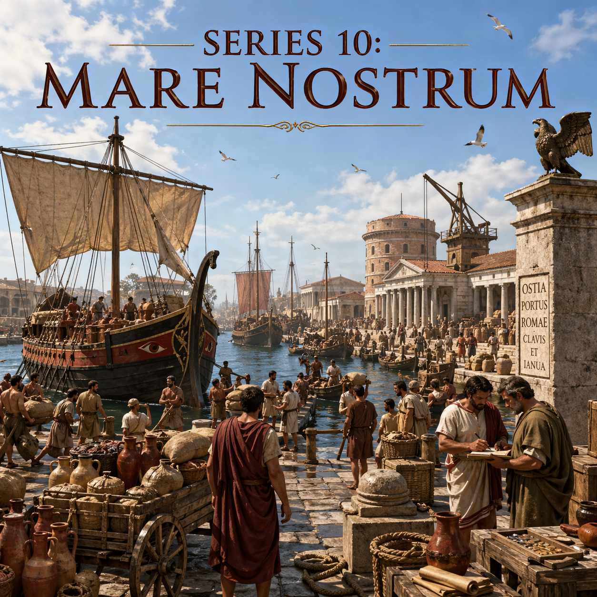

# 4장. 밀 무역의 잔혹사 — 싼 빵의 대가

## 돌아온 병사의 밭

전쟁에서 돌아온 병사는 먼저 자기 밭을 보았을 것입니다. 몇 년 전 떠날 때만 해도 거기에는 포도나무가 있었고, 올리브나무가 있었고, 가족이 먹을 밀밭이 있었습니다. 돌아와 보니 울타리는 무너져 있고, 물길은 막혀 있고, 잡초가 밭을 덮고 있었습니다. 아내와 아이들이 어떻게든 버텼겠지만, 농사는 한 사람의 부재를 오래 견디지 못했습니다.

그는 로마 시민이었습니다. 민회에 나가 표를 던질 수 있었고, 필요하면 군단에 들어가 공화정을 위해 싸웠습니다. 그러나 시민이라는 이름이 빚을 갚아주지는 않았습니다. 씨앗을 살 돈이 필요했고, 부서진 도구를 고칠 돈이 필요했고, 몇 년 동안 밀린 이자를 갚을 돈이 필요했습니다. 채권자는 기다리고 있었고, 옆의 큰 지주는 땅을 살 준비가 되어 있었습니다.

시장에서 그는 또 다른 소식을 들었을 것입니다. 곡물 값이 예전 같지 않다는 소식이었습니다. 시칠리아에서, 사르데냐에서, 북아프리카에서 배에 실린 밀이 로마와 이탈리아의 항구로 들어오고 있었습니다. 전쟁과 정복은 로마에 땅을 주었고, 그 땅은 곡물을 보냈습니다. 도시 소비자는 싸게 먹을 수 있었습니다. 그러나 작은 밭 하나로 살아가던 농민에게 싼 곡물은 축복이 아니라 가격 압박이었습니다.

이 장의 주인공은 그라쿠스 형제만이 아닙니다. 그들은 유명하고, 비극적이며, 로마 공화정 말기의 정치적 균열을 상징합니다. 하지만 그들이 원인은 아니었습니다. 그들은 증상이었습니다. 더 깊은 곳에서는 이미 구조가 움직이고 있었습니다. 전쟁이 사람을 빼앗고, 빚이 땅을 빼앗고, 노예 노동이 가격을 낮추고, 지중해 곡물망이 이탈리아 소농의 시장을 잠식하고 있었습니다.

로마는 더 싸게 먹을 수 있게 됐습니다. 바로 그 성공 때문에, 로마 공화정을 떠받치던 독립 자영농은 무너지고 있었습니다.

---

## 싸게 먹는다는 것은 누군가를 싸게 만든다는 뜻이다

로마의 공급망은 앞 장에서 보았듯이 기적에 가까웠습니다. 곡물은 항구로 들어왔고, 창고에 쌓였고, 강을 따라 도시로 올라갔습니다. 빵은 도시의 일상이 됐습니다. 문제는 그 기적이 모두에게 같은 의미가 아니었다는 데 있습니다.

도시 소비자에게 싼 곡물은 좋은 일이었습니다. 로마의 서민은 빵값이 낮아지면 하루를 버티기 쉬워졌습니다. 정치가는 곡물을 안정적으로 공급하면 민심을 얻을 수 있었습니다. 상인은 대량 거래를 통해 돈을 벌었습니다. 선주는 항해를 반복할 이유가 생겼습니다. 항만 노동자와 창고업자도 일감을 얻었습니다.

그러나 이탈리아 내륙의 소농에게 같은 사건은 다르게 다가왔습니다. 그는 자기 밭에서 수확한 밀을 팔아 빚을 갚고, 다음 해 씨앗을 마련하고, 가족을 먹여야 했습니다. 그런데 바다를 타고 들어온 속주 곡물이 더 싸게 팔리면 그의 밀이 설 자리는 좁아졌습니다. 고대 세계에서 육상 운송은 비쌌습니다. 이탈리아 산악 지대의 작은 밭에서 나온 곡물을 수레에 싣고 시장까지 보내는 비용은 결코 가볍지 않았습니다. 반면 시칠리아나 북아프리카의 곡물은 대량으로 배에 실려 움직일 수 있었습니다.

물론 그라쿠스 시대의 로마가 곧바로 이집트 밀에 의해 무너졌다고 쓰면 정확하지 않습니다. 티베리우스 그라쿠스의 호민관 활동은 기원전 133년이고, 가이우스 그라쿠스는 기원전 123년과 122년에 활동했습니다. 로마가 이집트를 정복한 것은 그보다 한 세기 가까이 뒤인 기원전 30년, 아우구스투스 시대였습니다. 그러므로 그라쿠스 형제를 낳은 직접 배경은 이집트가 아니라 시칠리아, 사르데냐, 북아프리카, 그리고 정복 전쟁이 만든 토지와 노예와 곡물의 흐름이었습니다.

이집트는 뒤에 옵니다. 그러나 뒤에 온다고 해서 중요하지 않은 것은 아닙니다. 이집트는 이미 시작된 구조를 완성했습니다. 지중해의 곡물 공급망이 도시 로마를 먹이고, 그 대가로 이탈리아 자영농의 정치적·군사적 기반을 약화시키는 구조는 그라쿠스 시대에 이미 드러났고, 아우구스투스 시대에 제국의 통치 장치로 굳어졌습니다.

싼 곡물은 경제적으로 효율적이었습니다. 그러나 효율은 언제나 질문을 남깁니다. 누가 싸게 사는가. 누가 싸게 팔 수밖에 없는가. 누가 시장에서 밀려나는가. 누가 그 손실을 보상받지 못하는가.

---

## 소농은 어떻게 무너졌는가

첫 번째 톱니는 전쟁이었습니다. 로마 공화정의 전성기는 전쟁의 연속이었습니다. 포에니 전쟁, 마케도니아 전쟁, 셀레우코스 전쟁, 히스파니아 원정이 이어졌습니다. 군단의 주력은 재산을 가진 시민 농민이었습니다. 작은 밭을 가진 남자가 방패를 들고 나가 싸웠고, 전쟁이 끝나면 다시 자기 밭으로 돌아온다는 것이 공화정의 이상이었습니다.

하지만 전쟁이 짧을 때만 그 이상은 유지될 수 있었습니다. 원정이 몇 해씩 이어지면 밭은 비었습니다. 농사는 계절을 놓치면 바로 손실이 납니다. 포도나무와 올리브나무는 돌봄을 필요로 했고, 곡물은 제때 뿌리고 거두어야 했습니다. 가족이 대신 버틸 수는 있었지만, 노동력이 빠진 농가는 취약해졌습니다. 병사가 돌아왔을 때 기다리는 것은 명예만이 아니었습니다. 빚과 황폐한 밭도 기다리고 있었습니다.

두 번째 톱니는 부채였습니다. 소농은 현금이 부족했습니다. 전쟁에서 돌아온 뒤 다시 농사를 시작하려면 씨앗과 도구와 가축이 필요했습니다. 흉년이 들면 빚을 냈고, 장기 복무로 밭이 망가지면 또 빚을 냈습니다. 이자가 붙으면 작은 밭은 오래 버티지 못했습니다. 땅은 담보가 되었고, 담보는 어느 순간 소유권으로 넘어갔습니다.

세 번째 톱니는 공유지였습니다. 로마가 이탈리아에서 이기고, 동맹시와 적대 도시의 땅을 몰수하면 그 일부는 국가의 공공 토지, 즉 아게르 푸블리쿠스(ager publicus)가 됐습니다. 법적으로는 공공의 땅이었습니다. 그러나 실제로는 힘 있는 자들이 넓게 점유했습니다. 오래 점유하면 자기 땅처럼 다루게 되고, 목축과 대농장 경영에 붙이게 됩니다. 기원전 367년의 리키니우스 법은 한 사람이 공공 토지를 500유게라 이상 점유하지 못하도록 제한했지만, 법은 오래전부터 유명무실해져 있었습니다.

네 번째 톱니는 노예 노동이었습니다. 정복 전쟁은 전리품만 가져오지 않았습니다. 사람을 가져왔습니다. 기원전 167년 에피루스에서는 수많은 도시가 약탈당했고, 대규모 포로가 노예가 됐습니다. 포에니 전쟁과 마케도니아 전쟁, 히스파니아와 동방의 원정은 계속해서 포로를 시장에 공급했습니다. 노예는 임금을 받지 않았습니다. 먹이고 재우는 비용은 있었지만, 자유 농민의 생계와 가족을 보장할 필요는 없었습니다.

대지주의 계산은 냉정했습니다. 넓은 땅을 가지고 있고, 전쟁 포로 노예를 살 수 있고, 곡물을 대량으로 팔거나 포도와 올리브 같은 상업 작물로 전환할 수 있다면 작은 농가보다 유리했습니다. 카토의 《농업론》은 감람유와 포도주 생산 농장을 거의 경영 매뉴얼처럼 다룹니다. 거기서 농장은 가족의 삶의 터전이라기보다 투자 단위입니다. 노예 몇 명이 필요하고, 관리인은 무엇을 해야 하며, 어떤 작물이 수익을 내는지가 계산됩니다.

이 변화가 이탈리아 전체에서 같은 속도와 같은 강도로 일어난 것은 아니었습니다. 지역마다 작물도 달랐고, 작은 농가가 모두 즉시 사라진 것도 아니었습니다. 그러나 정치가들이 위기로 느낄 만큼 압박은 커지고 있었습니다. 전쟁으로 사람이 빠지고, 부채로 땅이 흔들리고, 공공 토지는 유력자에게 넘어가고, 노예 노동은 생산 비용을 낮추고, 속주 곡물은 시장 가격을 누릅니다. 소농은 하루아침에 사라진 것이 아니었습니다. 서서히, 그러나 구조적으로 밀려났습니다.

---

## 땅을 잃은 시민은 무엇이 되는가

땅을 잃은 농민은 한 가지 길만 가지 않았습니다. 어떤 이는 대지주의 소작인이 됐습니다. 자기 땅에서 일하던 사람이 이제 남의 땅에서 일했습니다. 어떤 이는 계절 노동자가 됐습니다. 포도 수확철이나 올리브 압착철에만 일감을 얻었습니다. 어떤 이는 로마로 갔습니다. 도시에는 곡물 배급을 둘러싼 정치가 있었고, 일용직 노동과 선거 동원이 있었고, 폭력 조직이 있었습니다. 어떤 이는 군대에 남았습니다. 전쟁터는 위험했지만, 적어도 장군이 전역 후 땅을 줄 수도 있다는 희망을 제공했습니다.

여기서 로마 공화정의 근본 문제가 드러납니다. 자영농은 단순한 경제 계층이 아니었습니다. 그는 병사였고, 투표자였고, 재산을 신고하는 가장이었고, 공화정이 스스로를 상상하는 기본 단위였습니다. 로마의 이상 속 시민은 자기 땅을 가지고, 자기 무기를 들고, 자기 도시의 법을 지키는 사람이었습니다. 그가 무너지면 공화정은 단지 농업 구조를 잃는 것이 아니었습니다. 자신을 지탱하던 인간형을 잃었습니다.

이 문제를 현대식 조세 국가의 언어로만 설명하면 조금 어긋납니다. 기원전 167년 이후 로마 시민에게 부과되던 직접 전쟁세인 트리부툼(tributum)은 사실상 중단됐습니다. 마케도니아 전쟁의 전리품과 속주 수입이 로마 재정을 받쳐주었기 때문입니다. 따라서 그라쿠스 시대의 핵심 위기를 "소농이 줄어 국가 세입이 곧바로 감소했다"라고 말하기는 어렵습니다.

더 정확히 말하면, 먼저 무너진 것은 세입 기반이 아니라 시민-병사 기반이었습니다. 공공 토지에서 나와야 할 이익은 유력자의 사적 이익으로 흘러갔고, 군단의 전통적 모집 기반은 약해졌으며, 도시의 무산 시민은 정치 동원의 대상이 됐습니다. 국가는 속주에서 더 많은 수입을 얻고 있었지만, 그 수입이 공화정 내부의 사회적 균열을 자동으로 치유해주지는 않았습니다.

로마는 더 부유해졌습니다. 그러나 더 안정된 것은 아니었습니다. 부가 늘어나는 것과 공동체가 유지되는 것은 같은 일이 아니었습니다.

---

## 그라쿠스가 본 것

기원전 133년, 티베리우스 셈프로니우스 그라쿠스가 호민관이 됐습니다. 그는 가난한 집안 출신의 거리 선동가가 아니었습니다. 로마 귀족 사회의 중심에서 태어난 사람이었습니다. 그의 어머니 코르넬리아는 스키피오 아프리카누스의 딸이었고, 그의 집안은 공화정의 영광과 깊이 연결되어 있었습니다.

그가 제안한 것은 사유재산의 폐지가 아니었습니다. 공공 토지에 대한 기존 제한을 다시 집행하자는 것이었습니다. 한 사람이 점유할 수 있는 공유지의 상한을 되살리고, 초과분을 회수해 무토지 시민에게 나누자는 구상이었습니다. 오래전부터 법으로 존재했지만 지켜지지 않던 원칙을 다시 적용하자는 말이었습니다.

하지만 오래 방치된 불법은 어느 순간 기득권이 됩니다. 대지주들은 그 땅을 자기 재산처럼 여기고 있었습니다. 일부는 실제로 오래 경작했고, 일부는 매입과 임대를 섞어 복잡한 권리를 만들었고, 일부는 이탈리아 동맹시 사람들의 이해관계와도 얽혀 있었습니다. 티베리우스가 건드린 것은 빈 땅이 아니었습니다. 귀족들의 부, 체면, 장기 투자, 정치 권력의 기반이었습니다.

티베리우스의 유명한 연설은 이 균열을 도덕의 언어로 바꿨습니다. 이탈리아의 들짐승에게도 굴과 보금자리가 있는데, 로마를 위해 싸우는 시민에게는 자기 땅 한 뙈기가 없다는 호소였습니다. 이 말은 단순한 감상이 아니었습니다. 로마의 자기 이미지에 대한 공격이었습니다. 로마는 자유 시민의 공화정이라고 말하면서, 정작 그 자유 시민을 땅 없는 방랑자로 만들고 있지 않은가.

원로원은 격렬하게 반발했습니다. 동료 호민관 마르쿠스 옥타비우스가 거부권을 행사하자 티베리우스는 민회에서 그를 해임시켰습니다. 이것은 전례를 흔드는 조치였습니다. 법안은 통과됐지만, 원로원은 토지 배분 위원회의 예산을 막았습니다. 티베리우스는 페르가몬 왕 아탈루스 3세가 로마에 남긴 유산을 개혁 재원으로 쓰자고 했습니다. 이것은 원로원의 재정 권한을 직접 건드리는 일이었습니다.

그가 재선을 시도하자 사태는 폭력으로 끝났습니다. 기원전 133년, 선거가 진행되던 날 원로원파 인사들이 곤봉과 의자 다리를 들고 달려들었습니다. 티베리우스와 지지자 수백 명이 맞아 죽었습니다. 시신은 테베레강에 버려졌습니다.

이 순간 로마 정치의 금기가 깨졌습니다. 한쪽은 호민관의 신성성과 관행을 흔들었고, 다른 한쪽은 정치적 경쟁자를 공개 폭력으로 제거했습니다. 공화정은 여전히 법과 민회의 이름을 사용했지만, 그 안쪽으로는 폭력이 들어오기 시작했습니다.

---

## 가이우스가 본 것

티베리우스가 땅을 보았다면, 가이우스 그라쿠스는 도시를 보았습니다. 형이 죽고 10년 뒤, 가이우스는 호민관이 되어 더 넓은 개혁을 밀어붙였습니다. 토지 개혁을 되살리고, 도로 건설을 추진하고, 재판 제도와 속주 행정을 손보려 했습니다. 그중 가장 오래 남은 것은 곡물법이었습니다.

기원전 123년의 렉스 셈프로니아 프루멘타리아(Lex Sempronia Frumentaria)는 로마 시민에게 국가가 정한 가격으로 곡물을 살 수 있게 한 법이었습니다. 이것은 아직 무상 배급이 아니었습니다. 무상 배급은 훗날 기원전 58년 클로디우스 풀케르의 법으로 본격화됩니다. 그러나 가이우스의 법은 중요한 문을 열었습니다. 로마 국가는 이제 도시 시민의 빵값을 정치의 중심 문제로 인정했습니다.

이 법은 단순한 복지가 아니었습니다. 공급망 정치였습니다. 곡물을 확보하고, 저장하고, 정해진 가격에 내놓으려면 국가는 시장 안으로 들어와야 했습니다. 항구와 창고, 구매와 운송, 가격과 배급이 정치와 결합했습니다. 도시 빈민은 국가가 관리하는 곡물에 의존하게 됐고, 정치가는 곡물을 통해 도시의 지지를 조직할 수 있게 됐습니다.

여기에 역설이 있습니다. 자영농을 살리려던 문제는 도시 빈민을 먹이는 문제로 이동했습니다. 땅을 잃은 시민이 로마로 들어왔고, 로마는 그들을 먹여야 했습니다. 곡물법은 고통을 완화했습니다. 그러나 동시에 새로운 의존을 만들었습니다. 시민은 자기 밭에서 나오는 밀 대신 국가가 관리하는 밀을 기다리게 됐습니다.

가이우스 역시 폭력으로 끝났습니다. 원로원은 경쟁 법안을 내세워 그의 지지 기반을 흔들었고, 충돌이 벌어지자 기원전 121년 원로원 최종권고(Senatus Consultum Ultimum)를 발동했습니다. 국가를 구하기 위해 필요한 모든 조치를 취하라는 비상 선언이었습니다. 가이우스는 도망치다 죽었고, 지지자 수천 명이 처형되거나 학살됐습니다.

그라쿠스 형제의 죽음은 개혁의 실패만을 뜻하지 않았습니다. 그것은 공화정이 구조적 문제를 제도 안에서 해결하지 못한다는 신호였습니다. 땅의 문제는 빵의 문제가 됐고, 빵의 문제는 폭력의 문제가 됐습니다.

---

## 도시 빈민과 장군의 병사

소농의 몰락은 로마의 거리 풍경을 바꿨습니다. 땅을 잃은 사람들은 로마로 들어왔습니다. 그들은 프롤레타리우스(proletarius), 즉 재산으로는 기여할 것이 없고 자식만 낳는 사람이라는 이름으로 불렸습니다. 현대의 프롤레타리아라는 말은 여기서 나왔습니다.

이들은 인술라(insula)라 불리는 다층 임대주택에 살았습니다. 아래층에는 상점이 있었고, 위층으로 올라갈수록 방은 좁고 위험해졌습니다. 화재와 붕괴가 잦았고, 물과 위생은 불안정했습니다. 그러나 이들에게는 표가 있었습니다. 민회에 나갈 수 있었고, 정치가들은 이들을 동원할 수 있었습니다. 음식, 현금, 구경거리, 보호가 표와 교환됐습니다.

동시에 군대도 달라졌습니다. 전통적으로 로마 군단은 일정한 재산을 가진 시민을 전제로 했습니다. 자기 땅이 있는 사람이 군복무를 하고 돌아와 다시 농민이 된다는 순환이었습니다. 그러나 그 순환이 약해지자 군대는 새로운 사람을 필요로 했습니다.

기원전 107년, 가이우스 마리우스는 전통적으로 재산 기준 아래에 있던 무산 시민까지 군단에 받아들이는 방향으로 나아갔습니다. 이 변화는 하루아침에 완성된 단일 개혁이라기보다, 긴 압박 속에서 나타난 전환으로 보는 편이 더 정확합니다. 그러나 결과는 분명했습니다. 군단은 채워졌고, 로마는 외적을 막을 수 있었습니다.

문제는 전역 후였습니다. 무산자 병사에게는 돌아갈 밭이 없었습니다. 그가 바라는 것은 국가의 추상적 감사가 아니라 구체적인 토지 배분이었습니다. 누가 그것을 줄 수 있는가. 원로원인가, 민회인가, 아니면 전쟁에서 승리한 장군인가. 점점 더 많은 병사들이 국가보다 장군에게 기대기 시작했습니다.

마리우스, 술라, 폼페이우스, 카이사르의 시대가 여기서 열립니다. 장군은 병사에게 전리품과 토지를 약속했고, 병사는 장군에게 정치적 힘과 물리적 폭력을 제공했습니다. 싼 곡물과 토지 집중으로 시작된 균열은 결국 군단의 충성 구조를 바꾸었습니다. 로마 공화정은 외부의 적보다 먼저 자기 내부의 사회경제적 변형에 의해 약해졌습니다.

---

## 이집트는 완성형이었다

이제 이집트로 돌아올 수 있습니다. 그라쿠스 형제의 시대에는 이집트가 아직 로마의 속주가 아니었습니다. 그러나 기원전 30년, 옥타비아누스가 알렉산드리아에 들어가고 클레오파트라의 왕국이 무너지자 상황은 달라졌습니다. 이집트는 황제의 특별한 속주가 됐습니다. 원로원 의원은 황제의 허가 없이 이집트에 들어갈 수 없었습니다.

왜 그렇게까지 했을까요. 이집트는 단순한 속주가 아니었습니다. 그것은 로마의 식량 창고였습니다. 나일강의 범람은 비옥한 흙을 남겼고, 오래된 관개 체계는 대량 생산을 가능하게 했습니다. 곡물은 나일강을 따라 알렉산드리아로 모였고, 알렉산드리아에서 대형 선박에 실려 지중해를 건넜습니다. 오스티아와 포르투스는 그 곡물을 받아 로마의 배를 채웠습니다.

이집트 지배는 로마 식량 정치의 완성형이었습니다. 그라쿠스 시대에 드러난 문제, 즉 도시 로마를 먹이는 일이 공화정 정치의 핵심이 된다는 사실을 아우구스투스는 제국 통치의 중심 장치로 바꿨습니다. 이제 빵은 단순한 시장 상품이 아니었습니다. 황제의 권위를 매일 증명하는 물건이었습니다.

기원전 58년 클로디우스의 무상 곡물 배급 이후, 그리고 제정기의 아노나 체계 속에서 로마 시민은 국가가 관리하는 식량 공급에 더 깊이 연결됐습니다. 황제는 군단을 통제해야 했고, 속주를 통제해야 했고, 이집트를 통제해야 했고, 오스티아를 통제해야 했습니다. 이 모든 것은 결국 로마 시내의 빵 한 덩어리로 모였습니다.

싼 빵은 로마를 안정시켰습니다. 동시에 로마를 의존하게 만들었습니다. 항구가 막히면 정치가 흔들렸고, 이집트가 흔들리면 황제의 권위가 흔들렸습니다. 공급망은 풍요를 만들었지만, 그 풍요는 새로운 취약성을 만들었습니다.

---

## 세계화의 오래된 그림자

이 이야기가 낯설지 않은 이유가 있습니다. 현대 세계도 같은 질문을 반복해왔기 때문입니다. 자유무역과 세계화는 전체 파이를 키울 수 있습니다. 더 싼 상품이 들어오면 소비자는 이득을 봅니다. 가난한 나라의 제조업 노동자는 일자리를 얻을 수 있고, 세계 전체의 빈곤율은 낮아질 수 있습니다. 토머스 프리드먼의 《렉서스와 올리브 나무》 같은 책이 보았던 것은 바로 이쪽의 세계였습니다. 연결은 성장과 효율을 만들고, 닫힌 경제보다 열린 경제가 더 많은 기회를 만든다는 믿음입니다.

그 말에는 진실이 있습니다. 실제로 20세기 말과 21세기 초의 세계화는 많은 개발도상국을 세계 시장으로 끌어냈고, 수억 명의 사람들에게 공장 임금과 도시 일자리를 제공했습니다. 세계 전체로 보면 극단적 빈곤은 장기적으로 줄었습니다. 그러나 전체의 진실이 부분의 고통을 지워주지는 않습니다.

1999년 11월, 시애틀에서 열린 세계무역기구(WTO) 각료회의는 거대한 시위에 가로막혔습니다. 노동조합, 환경운동가, 학생, 농민 단체, 인권 단체가 한 도시로 모였습니다. 그들은 모두 같은 생각을 가진 것은 아니었습니다. 어떤 이는 노동권을 걱정했고, 어떤 이는 환경을 걱정했고, 어떤 이는 다국적 기업의 권력을 걱정했습니다. 그러나 공통된 감각은 있었습니다. 세계화가 누군가에게는 기회지만, 누군가에게는 자기 삶을 결정할 권리를 빼앗는 힘처럼 느껴진다는 감각이었습니다.

그 뒤의 20년은 이 감각을 더 선명하게 만들었습니다. 미국과 유럽의 제조업 지역은 압박을 받았습니다. 공장은 문을 닫거나 해외로 옮겨갔고, 지역 사회는 일자리와 세수와 자부심을 함께 잃었습니다. 경제학자들은 중국산 수입 증가가 특정 지역 노동시장에 큰 충격을 주었다고 분석했습니다. 소비자는 더 싼 물건을 샀지만, 어떤 지역의 노동자는 자기 기술과 임금과 공동체를 잃었습니다.

최근의 "K자형 경제"라는 표현도 같은 문제를 다른 언어로 말합니다. 전체 경제 지표는 좋아 보일 수 있습니다. 주식시장은 오르고, 고소득 전문직은 더 많은 자산을 쌓고, 기술과 자본을 가진 사람은 연결의 이익을 누립니다. 그러나 다른 쪽에서는 임금이 물가를 따라가지 못하고, 주거비와 교육비와 의료비가 생활을 압박하며, 경기 회복의 열매가 자신에게 오지 않는다고 느낍니다. 한 경제 안에서 어떤 사람은 위로 올라가고, 어떤 사람은 아래로 밀려납니다.

로마와 현대 사회가 같다는 뜻은 아닙니다. 로마에는 현대적 복지국가도, 산업 노동조합도, 중앙은행도, 민주적 대의제도 없었습니다. 그러나 반복되는 구조는 있습니다. 전체 효율은 증가합니다. 소비자는 싸게 삽니다. 특정 생산자는 탈락합니다. 탈락자의 손실은 충분히 보상되지 않습니다. 경제 문제는 곧 정체성의 문제, 지역의 문제, 계급의 문제, 정치적 분노의 문제가 됩니다.

로마의 싼 빵은 도시를 먹였습니다. 그러나 그 빵은 이탈리아 자영농의 몰락 위에 놓여 있었습니다. 현대의 싼 공산품은 소비자의 장바구니를 가볍게 만들었습니다. 그러나 어떤 공업 도시에서는 그 싼 가격이 공장 폐쇄와 지역 쇠퇴의 다른 이름이 됐습니다.

---

## 잃어버린 것은 밭만이 아니었다

그라쿠스 형제를 죽인 원로원은 단기적으로 이겼습니다. 토지 개혁은 좌절됐고, 공화정의 귀족 지배는 당분간 유지됐습니다. 그러나 그들이 막은 것은 개혁이었지, 구조 변화가 아니었습니다. 소농의 기반은 계속 흔들렸고, 도시 빈민은 계속 늘었고, 군단은 점점 장군에게 의존했습니다.

로마가 잃어버린 것은 밭만이 아니었습니다. 자기 땅을 가진 시민이 공화정을 지킨다는 오래된 균형이 무너졌습니다. 빵은 싸졌지만, 그 빵을 먹는 시민은 더 이상 예전의 시민이 아니었습니다. 그는 국가가 배급하는 곡물을 기다리는 도시 빈민일 수도 있었고, 대지주의 땅을 빌려 일하는 소작인일 수도 있었고, 전역 후 장군의 토지 약속을 기다리는 병사일 수도 있었습니다.

이것이 밀 무역의 잔혹사입니다. 잔혹함은 굶주림에만 있지 않았습니다. 오히려 풍요 속에 있었습니다. 공급망은 성공했습니다. 곡물은 더 멀리서, 더 많이, 더 안정적으로 들어왔습니다. 로마는 먹었습니다. 그러나 그 성공이 오래된 사회계약을 부수었습니다.

세계화의 비극은 종종 실패가 아니라 성공에서 시작됩니다. 더 싸게 만들고, 더 멀리 보내고, 더 많이 소비하게 만드는 데 성공했을 때, 그 흐름에 밀려나는 사람들이 생깁니다. 그들이 충분히 보상받지 못하면 시장의 문제는 정치의 문제가 됩니다. 로마에서는 그것이 그라쿠스의 죽음, 마리우스의 군단, 술라의 행군, 카이사르의 루비콘으로 이어졌습니다.

다음 장에서는 이 연결망이 얼마나 멀리 뻗어 있었는지를 보겠습니다. 로마의 공급망은 지중해 안에서만 끝나지 않았습니다. 어느 순간 그것은 유라시아의 먼 동쪽, 신라의 무덤 속 녹색 유리병 같은 뜻밖의 물건으로도 흔적을 남겼습니다.
