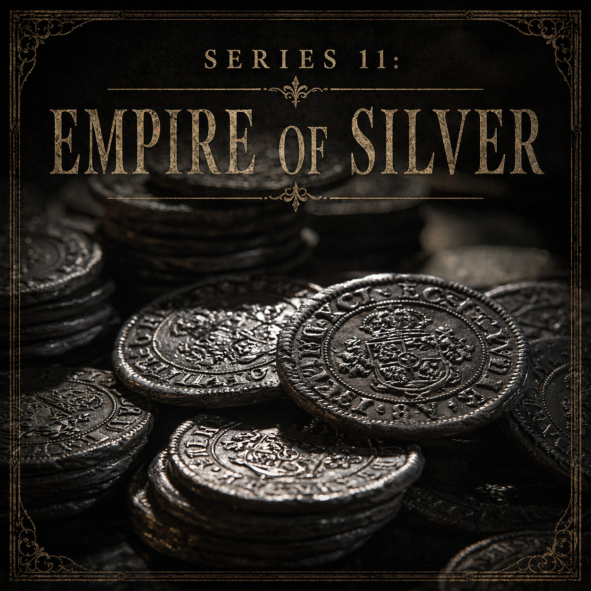

# 12장. 왕직과 회색 바다

## 한 섬에서 여러 바다를 굴린 사람

16세기 중반 어느 시점, 일본 히라도와 고토 열도 어딘가에 한 사람이 앉아 있었을 것입니다. 그는 황제가 아니었습니다. 총독도 아니었고, 합법적인 외교사절도 아니었습니다. 그런데도 그의 손이 닿는 범위는 웬만한 국가보다 넓었습니다. 중국 남동 연안의 상인과 일본 다이묘, 포르투갈인과 동남아 항구, 중국 비단과 일본 은, 유황과 무기, 심지어 사람의 몸까지 그의 네트워크 안에서 움직였습니다. 국가의 문서에는 그는 해적으로 남았습니다. 그러나 그렇게만 부르면 절반만 맞습니다.

그의 이름은 왕직입니다. 중국 안휘성 휘주 출신으로 알려진 그는 처음에는 소금 상인에 가까운 인물이었습니다. 그러나 명대의 해금 정책, 일본 은의 성장, 중국 비단과 동남아 상품의 수요, 포르투갈인의 등장이라는 조건이 겹치자 그는 단순 상인의 범위를 넘어섰습니다. 금지된 시장을 조직하고, 무장한 선단을 만들고, 일본의 섬을 거점으로 삼아 동아시아 바다 전체를 하나의 회색 회로로 묶었습니다. 최근 동아시아 해상사 연구들이 공통적으로 보여 주는 것은, 그가 단순한 약탈자가 아니라 상인과 해적의 경계를 오간 인물이었다는 점입니다.

왕직은 바다의 범죄자였고, 동시에 금지된 세계무역의 기획자였습니다. 국가가 닫아 놓은 시장을 어떻게든 이어 붙이는 사람, 한 항구의 금지령을 다른 항구의 기회로 바꾸는 사람, 국경이 아니라 가격을 따라 움직이는 사람 말입니다. 이 장의 핵심은 왕직을 미화하는 데 있지 않습니다. 오히려 그 반대입니다. 왕직을 통해 우리는 바다가 얼마나 회색이었는지 보게 됩니다. 상인과 해적, 운송업자와 노예상, 중개자와 약탈자가 한 사람 안에 겹쳐지는 세계 말입니다.

그는 영웅도 아니고, 단순한 악당도 아니었습니다. 그는 회색 바다의 얼굴이었습니다. 그의 재능을 인정하지 않으면 16세기 동아시아 해상경제를 이해할 수 없고, 그의 폭력을 보지 않으면 그 경제의 어두운 비용을 외면하게 됩니다. 왕직은 바로 그 불편한 두 진실을 동시에 들고 서 있는 인물입니다.

## 왜구는 일본 해적만이 아니었습니다

왕직을 이해하려면 먼저 왜구라는 말부터 의심해야 합니다. 중국의 기록은 이들을 흔히 일본 해적으로 불렀습니다. 그러나 16세기 중반의 왜구는 단일 민족 집단이 아니었습니다. 그 안에는 중국 상인, 일본 무장세력, 동남아 네트워크, 포르투갈인, 조선과 류큐 주변의 중개자까지 뒤섞여 있었습니다. 어떤 집단은 거래와 밀수를 했고, 어떤 집단은 약탈과 납치를 했습니다. 대개는 그 둘을 함께 했습니다.

그러므로 왜구는 국적이라기보다 상태에 가까웠습니다. 국가 바깥으로 밀려난 해상 상업이 무장한 형태였던 셈입니다. 케임브리지와 옥스퍼드 계열의 연구들이 보여 주듯, 1548년 이후의 왜구 위기는 특히 초국적이었습니다. 중국 남동 연안의 사람들은 일본인, 말라카 사람들, 시암 상인들, 포르투갈인, 심지어 아프리카계 모험가들과도 얽혔습니다. 이들은 바다의 안전을 파괴했지만, 동시에 국가가 막아 놓은 물류를 실제로 이어 붙이는 역할도 했습니다.

왕직은 바로 이 혼성 세계에서 떠오른 인물입니다. 그는 일본 해적의 우두머리라기보다, 중국 상업 세계와 일본 은, 동남아와 유럽 무기까지 한 장부 안에 모으는 운영자에 더 가까웠습니다. 그가 일본 히라도와 고토 열도를 거점으로 삼을 수 있었던 것도 우연이 아닙니다. 일본은 은을 가지고 있었고, 중국 상품을 원했으며, 센고쿠 시대의 다이묘들은 외부 물자와 무기에 관심이 많았습니다. 일본의 정치적 분열과 중국의 해금이 만나는 자리에서 왕직 같은 인물이 자랄 수 있었습니다.

왜구라는 말은 그래서 오히려 우리를 속입니다. 마치 일본에서 온 외부 해적이 중국 해안을 괴롭힌 것처럼 보이게 만들기 때문입니다. 실제로는 중국 내부의 상업 욕망과 국가 통제, 일본의 은과 무장 수요, 포르투갈인의 진입과 동남아 항로가 함께 만든 구조였습니다. 왕직 이야기는 한 해적의 전기가 아니라, 해상 아시아 전체가 회색지대로 작동하던 방식의 축약판입니다.

## 쌍위, 금지된 항구의 수도

왕직의 세계를 가장 잘 보여 주는 장소 가운데 하나가 쌍위입니다. 저장성 앞바다의 이 섬 항구는 16세기 전반 동아시아 최대의 밀무역 거점 가운데 하나로 성장했습니다. 케임브리지 계열 연구와 동아시아 해상사 자료들은 일본에서 1530년대 이후 대량의 은이 나오기 시작하자, 쌍위에서 왜구와 밀무역 세력이 일본의 은과 무기를 중국의 비단실, 직물, 도자기, 부채, 진주와 교환했다고 설명합니다. 이것은 단순한 해적 소굴이 아니었습니다. 명 조정이 허용하지 않는 민간 국제무역의 대안 수도에 가까웠습니다.

쌍위가 흥미로운 이유는 상품과 사람의 구성이 매우 국제적이었다는 점입니다. 중국 상인과 일본 무장세력만 있었던 것이 아닙니다. 포르투갈인, 말라카와 시암 쪽 사람들, 여러 출신의 선원과 하인이 얽혔습니다. 물건도 다양했습니다. 은만 오간 것이 아니라 무기와 비단, 사치품과 생활품이 함께 오갔고, 그 흐름은 동아시아와 동남아시아를 동시에 향했습니다. 국가가 보기에 그것은 불법이었습니다. 상인의 눈에는 그것이 오히려 현실이었습니다.

왕직이 이 세계에서 성장할 수 있었던 것도 그가 순수한 약탈자였기 때문이 아니라, 거래의 본질을 알고 있었기 때문입니다. 어떤 항구에 무엇이 모이고, 일본 은이 중국 비단과 만나면 얼마나 큰 차익이 나는지, 어느 다이묘가 안전한 후원자가 될 수 있는지, 어느 관리가 눈을 감을 수 있는지, 이런 감각이 없으면 그렇게 큰 네트워크를 묶을 수 없었을 것입니다. 그는 길 위의 강도가 아니라, 봉쇄된 바다 위에 사설 무역회사를 세운 사람처럼 보입니다.

쌍위의 번영은 명 조정에게 매우 불편한 현실이었습니다. 해금은 민간 해외무역을 막는 정책이었지만, 실제로는 거대한 수요를 없애지 못했습니다. 오히려 합법 항로가 막힌 만큼 쌍위 같은 장소의 가격 프리미엄은 커졌습니다. 위험이 높으면 이익도 높고, 이익이 높으면 더 많은 사람이 모입니다. 쌍위는 법의 실패가 시장을 어떻게 무장시킬 수 있는지를 보여 주는 항구였습니다.

## 일본 은과 중국 비단 사이의 차익

왕직의 사업 모델은 생각보다 단순했습니다. 국가가 막아 놓은 가격차를 자기 배로 연결하는 것이었습니다. 중국은 좋은 비단과 도자기, 공예품을 가지고 있었지만 민간 해외교역을 강하게 통제했습니다. 일본은 은을 가지고 있었지만 명과 정상적인 무역을 하기 어려웠습니다. 여기에 동남아 항로와 포르투갈 상인의 물건, 그리고 각지의 수요가 얹히면, 국가가 막는 순간 오히려 더 큰 기회가 열립니다.

합법적 거래가 닫힐수록 불법적 중개는 더 비싸집니다. 더 비싸질수록 더 큰 배와 더 강한 무장이 필요해집니다. 더 강한 무장이 들어오면 상인과 해적의 경계는 흐려집니다. 왕직은 바로 이 경제학을 누구보다 빨리 이해한 사람이었습니다. 그는 단지 물건을 운반한 것이 아니라, 금지 그 자체를 상품으로 바꾸었습니다. 위험이 크다는 사실은 가격을 올렸고, 법의 장벽은 그의 배에 프리미엄을 붙였습니다.

그의 네트워크가 실어 나른 물건들은 이 회색 경제의 성격을 잘 보여 줍니다. 직물, 소금, 유황, 초석, 무기, 일본 은, 중국 비단, 도자기, 동남아 상품이 같은 바다 위에서 움직였습니다. 유황과 초석은 화약과 연결되고, 무기는 일본 전국시대의 전장과 연결됩니다. 은과 비단은 중국의 수요와 일본의 소비를 연결합니다. 같은 배가 상업과 폭력의 재료를 함께 싣는 순간, 그 배를 상선이라고 부를지 해적선이라고 부를지는 더 이상 간단하지 않습니다.

우리는 오늘날 밀수나 제재 회피를 떠올릴 때 비슷한 구조를 생각하게 됩니다. 어떤 상품이 금지되면 사라지는 것이 아니라 더 비싸집니다. 더 비싸지면 더 위험한 사람들이 그 시장에 들어옵니다. 왕직은 16세기 동아시아에서 이미 그 논리를 실전으로 보여 주고 있었습니다. 그는 금지와 수요 사이에서 생긴 가장 비싼 틈을 조직한 사업가였습니다.

## 그는 왜 그렇게 많은 사람을 끌어들였을까요

케임브리지 연구는 왕직이 1540년대 중국인과 일본인 양쪽에서 꽤 큰 찬탄을 받았다고 적습니다. 심지어 많은 사람들이 자신의 아들과 딸을 그의 네트워크 안으로 보내려 했다는 기록까지 나옵니다. 처음 읽으면 이상합니다. 왜 위험한 해적 두목이 그렇게까지 매력적이었을까요. 답은 냉정합니다. 그가 돈이 되는 길을 알고 있었기 때문입니다.

국가의 합법적인 제도 안에서는 위로 올라갈 수 없는 사람들이 있었습니다. 연안의 하층민, 이미 장사가 막힌 사람들, 공식 시장에서 배제된 사람들, 지방에서 재능은 있지만 출세할 통로가 없는 사람들 말입니다. 그들에게 왕직은 단순한 범죄자가 아니라, 국가 명령을 비웃고 실제 부를 움켜쥔 사람처럼 보였을 것입니다. 그의 선단은 위험했지만, 그 위험은 굶주림이나 정체보다 나아 보였을 수 있습니다.

케임브리지 연구는 이런 감정을 단순한 일탈로 보지 않습니다. 오히려 성장하는 중국 경제가 만들어 낸 긴장, 곧 시장의 기회는 커지는데 정식 통로는 부족했던 상황 속에서 이해해야 한다고 설명합니다. 요컨대 왕직은 빈곤만이 아니라, 접근 불가능한 번영이 낳은 인물이었습니다. 해적은 언제나 절망만이 아니라 기회의 그림자이기도 합니다. 왕직은 바다의 질서를 파괴했지만, 동시에 많은 사람에게는 공식 세계 바깥에도 길이 있다는 신호로 읽혔습니다.

이 유혹은 그를 더욱 위험하게 만들었습니다. 단순한 도적은 군대로 잡으면 됩니다. 그러나 왕직 같은 인물은 경제적 욕망을 대신 실현해 주었기 때문에, 그의 뒤에는 물건을 맡긴 상인과 길을 안내한 선원, 눈감은 관리와 후원한 지방 세력이 붙었습니다. 해적왕이라는 말은 낭만적이지만, 실제로는 매우 실무적인 뜻을 가집니다. 그는 폭력을 조직했을 뿐 아니라 신용과 정보와 사람의 욕망도 조직했습니다.

## 회색 바다는 사람도 실어 날랐습니다

하지만 여기서 멈추면 왕직을 지나치게 낭만화하게 됩니다. 회색 바다는 돈만 실어 나르지 않았습니다. 사람도 실어 날랐습니다. 케임브리지의 같은 연구는 왜구 네트워크가 인신매매와 노예거래에도 깊이 얽혀 있었다고 설명합니다. 1556년 저장 연안 사령관의 사절이 일본 규슈에 갔을 때, 사쓰마에서 2백에서 3백 명의 중국인이 노예로 일하고 있는 것을 보았다는 기록이 나옵니다. 그들은 남부 푸젠 출신으로, 대략 20년 전에 왜구에게 붙잡혀 일본 가정에 팔린 사람들이었습니다.

이것은 왕직의 세계를 정면으로 어둡게 만듭니다. 케임브리지 연구는 또 포르투갈 상인들이 일본과 마카오 사이에서 중국 여성과 일본인 등을 실어 나르며 인신매매에 관여했다고 보여 줍니다. 바다는 비단과 은, 유황과 총포만 실은 것이 아니라, 사슬에 묶인 사람들도 실어 날랐습니다. 고토 열도와 히라도, 마카오와 말라카, 심지어 리스본까지 이어지는 항로 위에서 사람은 화물처럼 취급되기도 했습니다.

이 대목을 빼면 왕직은 지나치게 멋있어 보입니다. 그러나 그는 멋있는 모험가가 아니었습니다. 그는 폭력을 이용해 사업을 키운 해상 기업가였고, 그 사업에는 사람을 물건처럼 다루는 잔혹함이 포함되어 있었습니다. 이것이 회색 바다의 진짜 얼굴입니다. 합법과 불법의 경계만 흐린 것이 아니라, 인간과 화물의 경계마저 흐려지는 세계 말입니다. 그러므로 왕직을 시장의 천재라고만 부르는 것은 위험합니다. 그의 재능은 실재했지만, 그 재능은 칼과 공포, 납치와 매매 위에 세워진 것이기도 했습니다.

## 해금의 역설

그렇다면 명나라는 왜 이런 인물을 낳았을까요. 핵심은 해금입니다. 명의 해금 정책은 민간의 해외교역을 강하게 통제하려는 시도였습니다. 그러나 16세기의 해금은 불법을 없애기보다 오히려 광범한 연안 주민을 범죄화하는 효과를 냈습니다. 바다에 의존해 살아가는 사람들에게 합법적인 출구를 닫아 버리면, 결국 그들은 더 비싸고 더 위험한 회색시장을 만들게 됩니다.

이것은 단순한 도덕의 문제가 아니라 경제의 문제입니다. 합법 경로가 막히면 가격차가 벌어집니다. 가격차가 벌어지면 위험을 감수하려는 사람이 등장합니다. 이익이 커질수록 더 큰 배와 더 정교한 조직이 필요합니다. 그렇게 해적과 상인의 경계가 흐려지고, 지방 엘리트와 관리들까지 그 이익에 엮이게 됩니다. 일부 연구자들이 말하는 관복 입은 해적이라는 표현은 바로 이런 상태를 가리킵니다. 공식적으로는 단속해야 할 사람들이 실제로는 밀수와 보호장사에 얽혀 있었다는 뜻입니다.

이 구조를 보면 왕직은 특별한 예외가 아닙니다. 그는 해금이 낳은 가장 성공적인 부산물이었습니다. 명이 바다를 너무 강하게 닫으려 했기 때문에, 오히려 그 바다는 더 비싸고 더 무장된 시장으로 되돌아왔습니다. 그리고 왕직 같은 사람은 바로 그 시장에서 군주처럼 행동할 수 있었습니다. 해금은 국가가 바다를 통제하기 위한 제도였지만, 실제로는 바다의 불법 권력을 더 값비싸게 만들었습니다.

## 쌍위를 부숴도 바다는 닫히지 않았습니다

명 조정도 물론 손 놓고 있지는 않았습니다. 1547년 조정은 주완을 절강과 복건의 해상 문제를 다루는 강력한 관리로 보냈고, 그는 왜구와 밀무역 세력을 강하게 진압했습니다. 1548년 명군은 쌍위를 공격해 파괴했습니다. 여러 자료는 이 공격으로 수십 척의 배가 침몰하고 많은 밀무역자가 죽거나 붙잡혔다고 전합니다. 국가 입장에서는 분명한 반격이었습니다. 그러나 문제는, 항구 하나를 부쉈다고 욕망 전체가 사라지는 것은 아니라는 데 있었습니다.

쌍위를 부숴도 시장은 사라지지 않았습니다. 오히려 해적 네트워크는 더 남쪽과 더 바깥으로 퍼졌고, 왕직 같은 규슈 기반 중국계 해상 두목들은 더 큰 작전을 벌였습니다. 케임브리지 연구는 이들이 심지어 중국 경제의 심장부인 강남, 곧 항저우와 쑤저우, 난징 일대까지 공격했다고 적습니다. 국가는 소굴 하나를 부쉈지만, 바다 전체를 장악하지는 못했습니다.

이 장면은 현대적으로도 익숙합니다. 중심지를 하나 급습했다고 해서 물류 자체가 사라지지는 않습니다. 공급망은 경로를 바꿀 뿐입니다. 쌍위가 무너지자 회색시장도 그만큼 더 넓어지고 더 분산되었습니다. 왕직은 바로 그 분산된 네트워크를 다시 묶는 이름이 되었습니다. 그는 항구 하나를 소유한 것이 아니라, 항구들 사이를 연결하는 관계를 소유하려 했습니다. 그래서 더 위험했습니다.

## 그는 합법을 원했을지도 모릅니다

왕직의 마지막이 흥미로운 이유는, 그가 단지 끝까지 반역자로만 남은 것은 아니라는 점입니다. 후대의 여러 기록과 연구가 시사하듯, 그는 어느 순간 해상 금지를 완화하고 자신과 자신의 네트워크를 합법적 교역 안으로 편입시키는 길을 원했던 것으로 보입니다. 명의 장수 호종헌은 그를 회유했고, 왕직은 결국 협상 가능성을 믿고 중국 쪽으로 나왔습니다. 그러나 중앙 조정의 판단은 달랐습니다. 그는 1560년 처형되었습니다.

이 결말은 너무 상징적입니다. 왕직은 금지된 시장을 가장 잘 조직한 사람이었고, 어쩌면 누구보다도 그 시장을 합법으로 돌려놓고 싶었을지 모릅니다. 하지만 국가는 그를 사례로 삼아 목을 베었습니다. 문제는 그 목을 벤다고 해서 그가 보여 준 경제 논리까지 사라지지는 않았다는 데 있습니다. 오히려 역사는 그 반대로 흘렀습니다. 1567년, 명나라는 결국 일본을 제외한 민간 해외교역을 허용하는 쪽으로 방향을 틀었습니다. 월항을 통한 합법 무역의 길이 열리면서, 어제의 밀수 논리 일부는 내일의 상업 제도 안으로 들어갔습니다.

이것이 이 장의 가장 강한 아이러니입니다. 왕직은 죽었지만, 왕직의 논리는 살아남았습니다. 국가는 그를 처형한 뒤에야 결국 그가 이미 알고 있던 사실, 곧 바다를 영원히 닫아 둘 수 없다는 사실을 인정하게 된 것입니다. 물론 해금 완화가 모든 문제를 해결한 것은 아닙니다. 일본과의 직접 교역은 여전히 제한되었고, 해상 질서는 계속 불안했습니다. 그러나 1567년의 전환은 명 조정도 무한한 금지가 불가능하다는 현실을 받아들였음을 보여 줍니다.

## 바다는 국가보다 먼저 세계화되었습니다

왕직 이야기가 중요한 이유는, 이 책의 시야를 다시 한 번 넓혀 주기 때문입니다. 우리는 지금까지 포토시의 광산, 세비야의 장부, 마닐라의 환전, 중국과 일본의 은을 따라왔습니다. 그러나 그 큰 구조 사이를 실제로 메운 사람들은 언제나 국가만이 아니었습니다. 중개인과 통역자, 선주와 해적, 밀수상과 모험가, 지방 엘리트와 부패한 관리들이 그 틈을 메웠습니다.

왕직은 그 가운데 가장 노골적인 얼굴입니다. 그는 바다가 국가보다 먼저 세계화되었다는 사실을 몸으로 보여 줍니다. 국가의 제도는 아직 국경을 붙들고 있었지만, 시장과 사람, 은과 비단은 이미 그 국경을 자꾸 넘어가고 있었습니다. 그래서 그의 삶은 단순한 일화가 아닙니다. 그것은 일종의 경고입니다. 어떤 국가도 수요와 가격차, 이동의 욕망을 명령문 하나로 지울 수는 없습니다. 금지가 강할수록 우회는 더 정교해지고, 규제가 거세질수록 회색지대는 더 전문화됩니다.

이 점에서 그는 너무 현대적입니다. 제재 회피 무역, 밀수 자본, 그림자 물류, 규제 차익, 사설 폭력의 시장화 같은 오늘의 문제들이 이미 그 시대 바다 위에 다 있었습니다. 이름만 달랐을 뿐입니다. 왕직은 명대의 특수한 인물이지만, 그가 보여 준 구조는 반복됩니다. 국가가 막으면 시장은 우회하고, 우회가 이익을 만들면 폭력이 붙고, 폭력이 붙으면 다시 국가가 진압에 나섭니다. 이 오래된 순환이 동아시아 바다 위에서 선명하게 드러났습니다.

## 회색 바다의 진짜 의미

이 장의 제목을 회색 바다라고 붙인 이유는 단순합니다. 여기에는 검은색도 흰색도 거의 없기 때문입니다. 왕직은 명의 입장에선 해적이고 반역자였습니다. 그러나 해금에 막힌 상인에게는 길을 열어 주는 사람이었습니다. 가난한 사람에게는 기회의 상징이기도 했고, 납치된 사람에게는 재앙 그 자체이기도 했습니다. 그는 시장을 움직였지만, 동시에 사람을 파괴했습니다.

그러니 이 인물을 단순히 칭찬하거나 단죄하는 것은 모두 부족합니다. 우리가 봐야 할 것은 그가 대표하는 구조입니다. 바다는 국가의 선명한 법률 문장보다 늘 더 흐렸고, 그래서 더 현실적이었습니다. 세계무역은 언제나 회색지대를 품고 움직였고, 큰 제국의 공백은 종종 이런 인물들이 메웠습니다. 왕직은 그 가장 불편한 증거입니다.

그리고 이 불편함은 다음 장으로도 이어집니다. 왜냐하면 차와 아편의 시대 역시, 겉으로는 제국과 조약의 이야기처럼 보이지만 실제로는 우회와 밀수, 합법과 불법의 회색지대 위에서 움직였기 때문입니다. 왕직은 앞선 시대의 유물만이 아닙니다. 그는 앞으로 올 19세기의 그림자를 먼저 보여 준 사람입니다.
