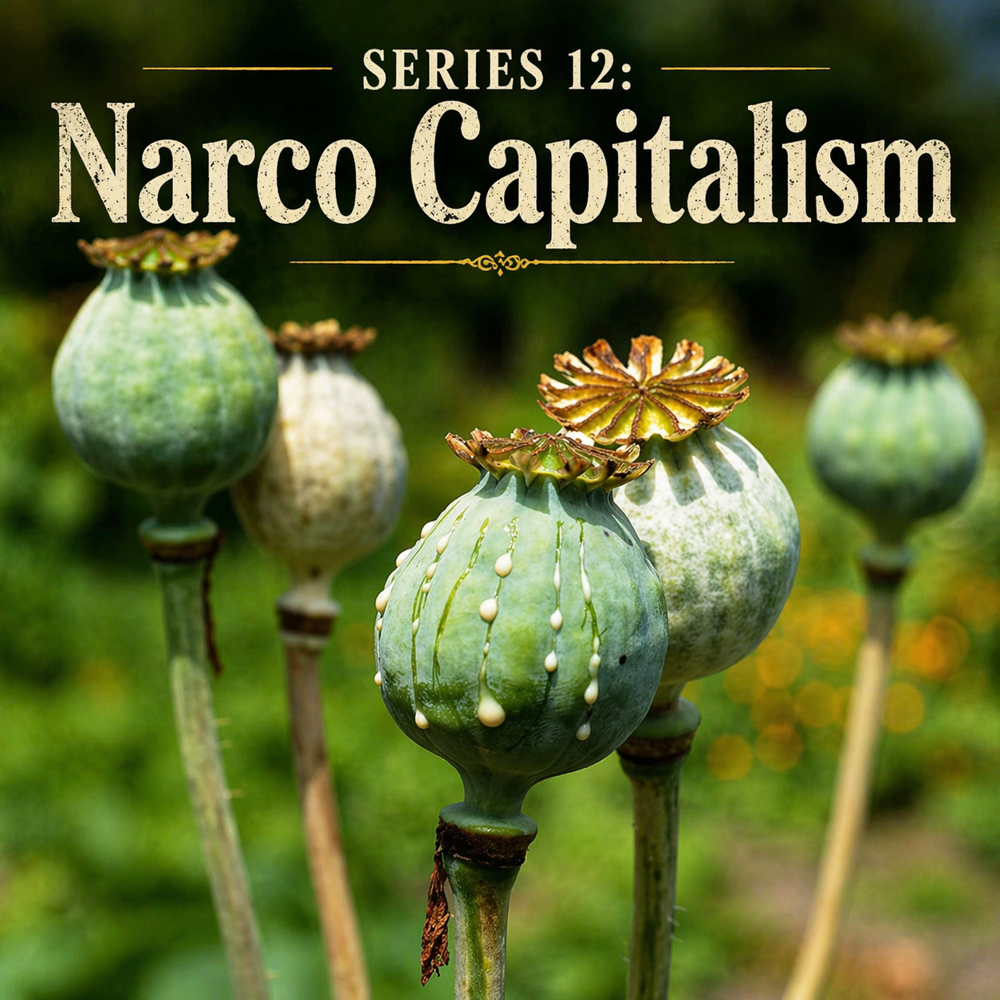

# 7장. 골든 트라이앵글

## 산과 국경이 겹쳐 있는 곳

지도를 보면 골든 트라이앵글은 그럴듯한 이름을 가진 지리 개념처럼 보입니다.

태국 북부, 라오스 북부, 미얀마 동북부가 서로 닿는 산악지대. 메콩강과 그 지류가 얽히고, 구름이 산등성이를 타고 흘러가고, 도로는 쉽게 직선으로 뻗지 않습니다. 멀리서 보면 낭만적인 국경 풍경처럼 보일 수도 있습니다. 그러나 이 지역을 실제 역사 속에서 보면, 그것은 단순한 풍경이 아니라 `국가의 힘이 얇아지는 공간`입니다.

바로 그 점이 중요합니다.

국가의 힘이 얇아지는 곳에서는 법이 완전히 사라지는 것이 아니라, 여러 종류의 법이 겹칩니다. 중앙정부의 법이 있고, 현지 무장세력의 질서가 있고, 종족 공동체의 관습이 있고, 상인과 운반책이 따르는 실제 규칙이 있습니다. 다시 말해, 이런 곳에서는 국경이 선으로 그어져 있어도 삶은 선처럼 움직이지 않습니다. 산길과 강줄기, 친족관계와 비공식 통로가 언제나 국가의 지도 위 선보다 더 오래갑니다.

골든 트라이앵글이 마약경제의 중심이 된 것도 결국 이 구조 때문입니다.

이곳은 국가가 전혀 없는 곳이 아니었습니다. 오히려 국가가 충분히 강하지 않아서, 다른 질서들이 함께 숨 쉬는 곳이었습니다. 그리고 높은 가치의 금지상품은 바로 이런 곳을 좋아합니다.

---

## 왜 양귀비는 이런 곳에서 자라는가

양귀비는 그 자체로 신비한 식물이 아닙니다.

그러나 어떤 경제 조건과 만나면, 그것은 놀라울 만큼 강한 현금작물이 됩니다. 산악지대의 소농에게 양귀비는 단위 면적당 가치가 높고, 보관이 비교적 쉽고, 운반 비용 대비 가격이 높다는 장점이 있습니다. 도로가 엉성하고, 국가 보조가 빈약하고, 시장 접근성이 낮고, 자급농만으로는 생계가 빠듯한 곳에서 이런 작물은 거의 필연적으로 유혹적이 됩니다.

그래서 골든 트라이앵글을 볼 때는 먼저 도덕보다 생계를 봐야 합니다.

많은 재배 농민에게 양귀비는 세계를 파괴하려는 음모가 아니라, 당장의 현금과 다음 계절의 생존 문제였습니다. 문제는 그 생계가 너무 쉽게 더 큰 네트워크의 맨 아래로 편입된다는 데 있습니다. 산간의 작은 밭은 결국 정제, 운송, 중개, 수출, 자금세탁으로 이어지는 훨씬 큰 사슬의 첫 고리가 됩니다.

이 점에서 골든 트라이앵글은 벵골의 양귀비밭과 닮아 있습니다.

맨 아래의 재배자는 언제나 취약하고, 위로 올라갈수록 이익은 커집니다. 다만 차이는 구조입니다. 벵골에서는 식민 국가가 이 사슬을 위에서 장악했습니다. 여기서는 국가 외에도 무장세력, 국경 상인, 운반 조직, 현지 권력자가 함께 이 사슬을 나눠 가집니다.

바로 그래서 이곳은 더 복잡합니다.

---

## 샨주는 왜 계속 중심인가

최신 UNODC 자료는 골든 트라이앵글의 현재를 아주 분명하게 보여 줍니다.

2024년 미얀마의 양귀비 재배 면적은 약 45,200헥타르로, 3년 연속 증가 뒤 처음으로 4퍼센트 줄어든 것으로 추정됩니다. 겉으로만 보면 약간의 후퇴처럼 보입니다. 그러나 그 숫자를 더 자세히 보면 오히려 다른 사실이 보입니다. 이것은 붕괴가 아니라 `높은 수준에서의 정체 또는 안정화`에 가깝습니다. 그리고 그 가운데 약 88퍼센트가 여전히 샨주에 몰려 있습니다.

이 숫자는 샨주의 성격을 잘 드러냅니다.

샨주는 단순한 행정구역이 아니라, 미얀마 국가와 여러 무장세력, 민병대, 국경 상인, 중국 남부와 연결된 경제 흐름이 겹쳐 있는 거대한 접경지대입니다. 중앙정부의 군사작전이 있더라도, 모든 산길과 마을과 거래를 완전히 장악하기는 어렵습니다. 어떤 곳에서는 국가보다 무장세력의 허가가 더 중요하고, 어떤 곳에서는 세금보다 통행료가 더 현실적입니다.

이런 공간에서는 금지상품이 오히려 더 잘 자랍니다.

왜냐하면 누구든 자기 몫을 떼어 갈 수 있기 때문입니다. 재배자는 현금을 얻고, 중개상은 수송료를 얻고, 현지 무장세력은 보호비나 세금을 얻고, 더 위의 네트워크는 정제와 장거리 운송의 차익을 얻습니다. 모두가 조금씩 걸려 있는 구조는 매우 질깁니다. 한 부분만 끊어서는 전체가 무너지지 않습니다.

이것이 샨주가 오랫동안 중심으로 남는 이유입니다.

양귀비가 자라서가 아니라, 양귀비가 자랄 만한 정치경제가 계속 재생산되기 때문입니다.

샨주의 지형은 이 정치경제를 더 끈질기게 만듭니다.

산악지대에서는 국가의 선이 지도처럼 깨끗하게 작동하지 않습니다. 도로 하나, 고개 하나, 강가의 나루 하나가 실제 권력의 단위가 됩니다. 어느 계곡은 중앙정부보다 현지 무장세력의 영향이 강하고, 어느 길은 공식 검문소보다 비공식 통행료가 더 중요합니다. 농민은 국가와 시장 사이에서만 사는 것이 아니라, 무장세력과 중개상, 국경 브로커와 지역 행정 사이에서 살아갑니다. 이런 곳에서 마약경제는 단순히 법을 어긴 상업이 아니라, 권력의 여러 층이 서로 타협하는 방식이 됩니다.

또한 산악지대의 가난은 선택지를 좁힙니다. 도로가 멀고, 합법 작물의 시장 접근성이 낮고, 교육과 의료가 부족하며, 국가가 제공하는 신용이 약할수록 단위 면적당 높은 현금을 주는 작물은 더 설득력을 갖습니다. 양귀비를 심는 사람은 세계를 망가뜨리려는 악당이 아닙니다. 대개는 자신에게 주어진 좁은 선택지 안에서 가장 현실적인 현금을 고르는 사람입니다. 그러나 그 선택은 곧 더 큰 네트워크의 첫 고리가 됩니다. 이것이 생산지의 비극입니다. 개인의 생존전략이 세계적 범죄경제의 원료가 됩니다.

---

## 아편에서 헤로인으로, 다시 메스로

골든 트라이앵글을 오래된 눈으로만 보면, 사람들은 여전히 양귀비와 생아편만 떠올리기 쉽습니다.

그러나 이 지역의 더 중요한 특징은 `한 가지 상품에만 머무르지 않는 능력`입니다.

아편은 여기서 끝이 아니라 시작입니다. 아편은 모르핀으로, 헤로인으로 더 높은 가치의 단계로 넘어갈 수 있습니다. 그리고 최근 수십 년의 흐름을 보면, 이 지역의 불법경제는 식물성 마약에만 묶여 있지 않았습니다. 합성마약, 특히 메스암페타민으로 무게중심이 크게 이동했습니다.

이 변화는 경제적으로 너무나 합리적입니다.

양귀비는 계절과 토지, 기후에 묶입니다. 반면 메스는 실험실과 전구체, 화학자와 보호망만 있으면 더 유연하게 생산할 수 있습니다. 재배면적과 수확량의 제약을 덜 받고, 수요에 빠르게 대응할 수 있으며, 가격과 물량을 더 공격적으로 조정할 수 있습니다. 산악지대의 작은 밭이 만들어 내는 제약을, 실험실과 창고와 국경 통로가 상당 부분 풀어 주는 셈입니다.

UNODC의 최근 동아시아·동남아 합성마약 보고서는 이 전환을 분명히 보여 줍니다.

2024년 동아시아와 동남아시아에서 압수된 메스암페타민은 사상 최대인 236톤에 이르렀고, 그 가운데 약 85퍼센트가 하부 메콩 국가들에서 적발되었습니다. 이 숫자는 두 가지를 뜻합니다. 첫째, 시장 규모가 상상을 넘어 커졌다는 것. 둘째, 골든 트라이앵글과 그 주변의 국경지대가 더 이상 `오래된 아편의 땅`만이 아니라, 현대 합성마약 허브로도 기능한다는 것입니다.

여기에도 단서가 필요합니다.

압수량은 생산량 그 자체가 아닙니다. 단속이 강화되어도 압수량은 늘 수 있고, 시장이 커져도 압수량은 늘 수 있습니다. 그러니 236톤이라는 숫자를 `실제 생산량`처럼 쓰면 안 됩니다. 그러나 그 숫자는 최소한 이 지역의 합성마약 흐름이 더 이상 주변적 문제가 아니라는 사실을 보여 줍니다. 경찰과 세관이 잡아낸 것만으로도 이 정도라면, 잡히지 않은 흐름까지 포함한 시장의 규모와 유연성은 훨씬 더 크다고 보아야 합니다.

또 하나 중요한 점은 아편·헤로인 네트워크와 메스암페타민 네트워크를 단순히 같은 조직의 계보처럼 쓰면 안 된다는 것입니다. 상품은 다르고, 생산 기술도 다르고, 필요한 원료와 인력도 다릅니다. 그러나 같은 산악지대, 같은 약한 국가 통제, 같은 국경 통로, 같은 보호세력과 부패 접점은 재사용될 수 있습니다. 골든 트라이앵글의 무서움은 바로 여기에 있습니다. 조직 하나가 영원히 산다는 뜻이 아니라, 인프라가 상품을 갈아타며 살아남는다는 뜻입니다.

이 지역의 불법경제는 퇴행적인 것이 아니라 오히려 적응력이 뛰어납니다.

수요가 바뀌면 상품을 바꾸고, 단속이 심해지면 통로를 바꾸고, 농업의 한계가 보이면 화학으로 이동합니다. 이 유연성 때문에 골든 트라이앵글은 늘 과거의 유물처럼 보이면서도, 실제로는 매우 현대적인 범죄경제 공간이 됩니다.

---

## 길은 산길에서 끝나지 않는다

골든 트라이앵글을 오해하는 가장 쉬운 방법은, 이것을 외딴 산속의 자급 범죄경제처럼 생각하는 것입니다.

실제로는 정반대입니다.

산길은 시작일 뿐입니다.

작은 밭에서 시작한 물건은 중개 거점으로 모입니다. 거기서 정제되거나 더 높은 가치의 형태로 바뀝니다. 다시 트럭과 보트, 오토바이, 도보 운반망을 타고 국경을 넘습니다. 더 아래에서는 항구와 창고, 도시 외곽의 환적 지점, 국경무역 허브가 기다립니다. 합성마약의 경우에는 이 연결이 더 직접적입니다. 실험실, 전구체 공급망, 저장시설, 운송책, 금융책이 한 체인으로 묶입니다.

바로 이 때문에 골든 트라이앵글은 단순한 생산지가 아닙니다.

그것은 `생산 + 정제 + 보호 + 수송 + 자금 흐름`이 함께 작동하는 경제권입니다.

그리고 이 구조는 국가 단위보다 훨씬 넓습니다.

태국 북부의 국경 검문소, 라오스의 특구, 미얀마 동북부의 무장세력 통제지역, 중국 남부와 이어지는 상업망. 이 모든 것이 서로 다른 속도로 연결됩니다. 어떤 길은 공식 무역의 이름으로 열려 있고, 어떤 길은 그 옆의 그림자 통로로 더 빠르게 움직입니다. 바로 이 점에서 골든 트라이앵글은 광저우 연안의 회색 바다와도 닮아 있습니다. 공식 질서와 비공식 흐름은 결코 완전히 분리되어 있지 않습니다.

샨주의 여러 `특별 지역`과 국경 경제권은 이 구조를 더 잘 보여 줍니다.

지도 위에서는 미얀마라는 국가의 일부이지만, 실제 생활세계에서는 중앙정부와 민족무장조직, 민병대, 국경 상인, 중국어권 자본, 현지 행정이 겹쳐 있습니다. 어느 지역에서는 미얀마 국가의 법보다 현지 무장세력의 허가와 통행료가 더 실질적인 규칙이 됩니다. 어느 길은 낮에는 합법 목재와 농산물, 소비재가 지나가고, 밤에는 다른 물건이 같은 도로와 창고를 이용합니다. 이렇게 되면 마약경제는 국가의 빈틈에 숨어 있는 작은 범죄가 아니라, 국경지대 정치경제의 한 기능처럼 작동합니다.

그래서 `생산지`라는 말도 조금 부족합니다.

골든 트라이앵글은 밭이면서 실험실이고, 산길이면서 창고이며, 무장세력의 재정 기반이면서 특구 개발의 뒤편입니다. 이곳에서 상품은 자꾸 얼굴을 바꿉니다. 아편은 헤로인이 되고, 전구체는 메스가 되고, 현금은 카지노와 호텔, 운송회사와 환전소의 언어를 배웁니다. 이 모든 변신을 가능하게 하는 것은 결국 국경의 얇은 통제와 오래된 중개망, 그리고 너무 많은 사람의 생계가 이미 거기에 달라붙어 있다는 사실입니다.

---

## 무장세력과 마약경제

이 지역에서 무장세력을 빼면 이야기가 성립하지 않습니다.

하지만 이 문제를 단순히 `반군이 마약을 판다`로 줄이면 반밖에 보지 못합니다.

무장세력은 여기서 국가의 부재를 채우는 존재이기도 하고, 국가와 거래하는 존재이기도 하며, 때로는 특정 지역의 사실상 조세권력처럼 기능하기도 합니다. 보호를 제공하고, 통행을 허가하고, 때로는 직접 생산과 유통에 관여하고, 때로는 세금을 떼어 갑니다. 즉, 무장세력은 폭력집단이면서 동시에 경제 주체입니다.

이것이 국경지대형 마약경제의 핵심입니다.

도시형 마약경제에서는 카르텔이 국가와 경쟁하거나 침투합니다. 반면 여기서는 무장세력 자체가 국가 비슷한 역할을 떠맡기도 합니다. 도로를 누가 지배하는가, 어느 마을에 누가 들어갈 수 있는가, 어떤 물건이 어느 길로 빠질 수 있는가가 모두 군사적 힘과 연결됩니다.

그래서 마약경제는 단지 `불법 소득`이 아닙니다.

그것은 무장질서의 재정 기반이 되기도 합니다.

그리고 바로 그 때문에 끊어내기가 더 어렵습니다. 이 흐름을 줄인다는 것은 단순한 범죄 단속이 아니라, 어떤 지역의 권력구조 자체를 흔드는 일이 되기 때문입니다.

---

## 특구와 카지노, 그리고 새로운 얼굴

하지만 골든 트라이앵글을 여전히 양귀비밭과 반군기지만으로 상상하면, 우리는 이 지역의 현대성을 놓치게 됩니다.

최근의 국경지대는 훨씬 더 복합적입니다.

특구가 생기고, 카지노가 들어서고, 관광과 물류와 창고, 온라인 사기, 자금세탁이 서로 가까워집니다. 겉으로는 개발과 투자처럼 보이는 시설들이, 실제로는 불법 자본이 숨어들고 세탁되고 재투자되는 통로가 되기도 합니다. 마약 돈은 절대로 현금 뭉치 형태로만 남아 있지 않습니다. 그것은 호텔이 되고, 운송회사가 되고, 환전업이 되고, 부동산이 되고, 때로는 국경 도시 전체의 분위기가 됩니다.

이 변화가 중요한 이유는 하나입니다.

마약경제가 더는 `밭`이나 `실험실`에만 갇혀 있지 않다는 뜻이기 때문입니다. 그것은 서비스업과 부동산, 국경무역과 오락산업의 얼굴을 하고 정상경제 곁으로 들어옵니다. 나중에 별도의 장에서 더 보겠지만, 카지노와 특구는 이런 흐름이 현대적으로 번역되는 중요한 무대입니다.

이 변화는 골든 트라이앵글을 훨씬 더 현대적인 문제로 만듭니다.

낡은 이미지는 양귀비밭과 산적, 노새와 비밀 통로입니다. 그러나 오늘의 국경지대에는 스마트폰, 온라인 도박, 카지노 VIP룸, 암호화된 메신저, 환전상, 특구 개발회사, 관광버스, 물류창고가 함께 있습니다. 오래된 산길은 사라진 것이 아니라 더 현대적인 결제와 서비스업의 옷을 입었습니다. 마약경제는 후진성이 아니라 적응력으로 살아남습니다. 그래서 이 지역을 낭만적인 변방으로 상상하면 위험합니다. 실제로는 세계화의 가장 어두운 최신판이 오래된 국경지대 위에 겹쳐져 있는 곳이기 때문입니다.

그러니 골든 트라이앵글은 낡은 세계가 아닙니다.

오히려 오래된 산길 위에 아주 현대적인 범죄 자본주의가 덧입혀진 세계입니다.

---

## 생산지의 하루는 어떻게 달라지는가

이 모든 구조를 거대한 지도 위에서 보면, 사람들은 금세 숫자와 세력 이름에 압도됩니다.

하지만 이 책은 늘 다시 생활 쪽으로 내려가야 합니다.

생산지의 하루는 어떻게 달라질까요.

양귀비를 심는 가정은 자급작물보다 현금작물 비중이 커집니다. 계절의 리듬이 계약과 선대금, 채무의 리듬과 맞물립니다. 마을의 젊은이는 농사보다는 운반이나 심부름, 더 나아가 무장세력 주변의 일거리 쪽으로 끌릴 수 있습니다. 길이 깔리고 물류가 생기면, 합법 상품과 불법 상품이 함께 더 빨리 드나듭니다. 현금은 잠깐 늘어날 수 있지만, 동시에 마을은 더 불안정해집니다. 누가 누구와 연결되어 있는지, 어느 집이 어느 세력과 가까운지, 어느 길이 안전한지, 이런 정보가 일상의 불안이 됩니다.

즉, 마약경제는 단지 돈을 벌게 하거나 못 벌게 하는 것이 아닙니다.

그것은 사람들의 시간을 바꾸고, 위험 감각을 바꾸고, 아이가 자라서 무엇을 직업처럼 상상할 수 있는지까지 바꿉니다.

이것이야말로 가장 깊은 변화입니다.

---

## 왜 골든 트라이앵글은 계속 돌아오는가

사람들은 종종 이렇게 묻습니다.

왜 이 지역 문제는 끝나지 않는가.

답은 간단하면서도 불편합니다.

이곳은 단지 마약 생산지가 아니라, `마약이 너무 많은 사람에게 너무 많은 방식으로 먹고사는 구조가 된 곳`이기 때문입니다.

재배 농민은 현금을 얻고, 운반책은 수수료를 얻고, 무장세력은 재정을 얻고, 중개상은 차익을 얻고, 특구와 세탁 인프라는 더 큰 자본을 얻습니다. 어느 한 축만 제거해서는 전체가 무너지지 않습니다. 양귀비가 줄면 메스가 늘고, 한 통로가 막히면 다른 국경이 열리고, 한 조직이 약해지면 다른 네트워크가 그 자리를 메웁니다.

이것이 바로 네트워크의 무서움입니다.

한 번 충분히 커지면, 그것은 개별 상품보다 오래 살고 개별 조직보다 오래갑니다.

골든 트라이앵글은 이 사실을 가장 분명하게 보여 줍니다. 산은 그대로 있고, 국경은 그대로 있고, 국가의 힘은 여전히 불균질하며, 높은 가치의 금지상품은 늘 새로운 모습을 찾아옵니다. 그러니 이 지역은 같은 이야기를 반복하는 것이 아니라, 같은 구조를 새로운 상품과 새로운 인프라로 계속 갱신하고 있는 셈입니다.

이 장에서 우리가 본 것은 단순한 범죄 서사가 아닙니다.

그것은 국경지대의 경제사였습니다.

다음 장에서는 이제 다시 바다와 항구 쪽으로 움직여 보려 합니다. 국가보다 오래 사는 중개망, 항구와 디아스포라, 회색 해상 네트워크가 어떻게 이 흐름을 더 멀리 실어 나르는지 보러 가겠습니다.
